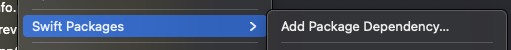
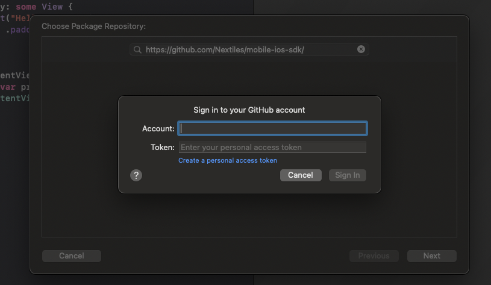
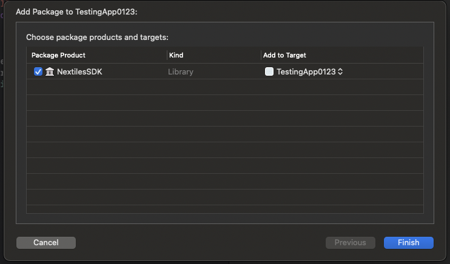
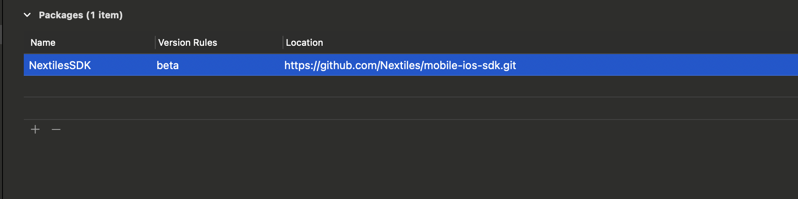

# NextilesSDK

Leverage the cutting edge Nextiles Technology, with Nextiles SDK and power your application with raw data stream. 

The following document talks about how to integrate the SDK in one's application. The document also provides a walkthrough on after installing the SDK; how to connect or disconnect a device, extract raw data and many other cool features.

### Features

### Platform Support

### License

### Install Nextiles SDK via SPM (Swift package manager)

1. Swift Package Manager is distributed with Xcode. To start adding the Nextiles SDK to your iOS project, open your project in Xcode and select File > Swift Packages > Add Package Dependency. Note:- XCode is at 12.5, at the time of this document.

2. Enter the Github repo URL (https://github.com/Nextiles/mobile-ios-sdk/) into the search bar and click Next.

3. You'll see a window for **Account** and **Token**. Nextiles' SDK Repository is private and hence you would need the token to be able to leverage the SDK. Need not to worry cause you will get that token from us. Use your github account for `account` and the token which we'll provide in `token`. And click **Next**

Note:- If you see an error: "The remote repository could not be accessed" then it's possibly cause of the already attached 
Github account to your XCode. Current git configuration doesn't have the token in it.

If you'd go to your menu XCode > Preferences > Account, you'll see the github account/or a Git account there. 

A fix is to remove that account and try from the step 1 again and this time XCode will prompt you for the **Account** and **Token**

4. You'll see the SDK repo rules for which version of SDK you want Swift Package Manager to install. Choose the second rule, branch, as it will try to leverage the dev branch (currently, as we're on the beta stage for the SDK, we'll select this), then click Next.

5. NextilesSDK should be automatically selected as it's the only package in this repo. Click **Finish**

6. You can always go back and modify which SPM packages are included in your project by opening the Swift Packages tab for your project: Click on the **Project** file in the **Xcode navigator**, then click on your project's icon, then select the **Swift Packages** tab.

7. In your app code, explicitly import NextilesSDK and test the SDK like this:

### Use NextilesSDK and it's features
