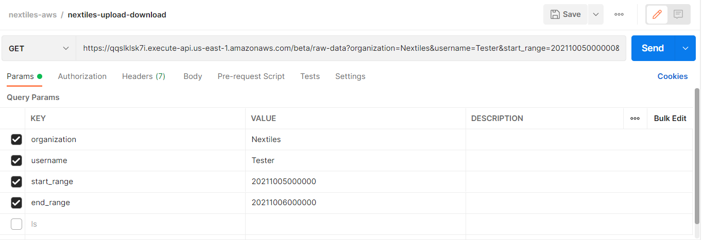
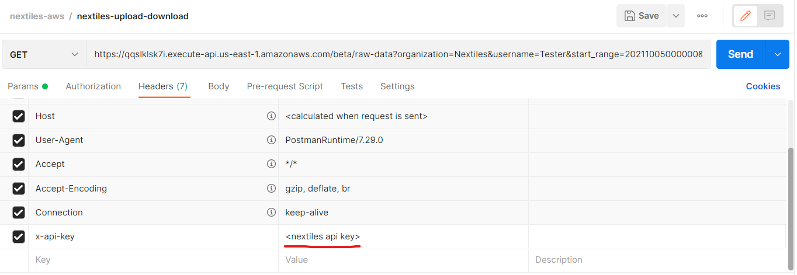

# Nextiles API Documentation

The following documentation discusses how to leverage Nextiles API to get stored raw data from Nextiles' servers.

## Table of Contents
- [Nextiles API Documentation](#nextiles-api-documentation)
  * [Implementation](#implementation)
    + [Get Endpoint](#get-endpoint)
    + [Authorization](#authorization)
  * [Responses](#responses)
  * [Status Codes](#status-codes)
  * [Examples](#example-use)
    + [Bash](#bash)
    + [Postman](#postman)
    + [Python](#python)

## Implementation

To access Nextiles' API, you are required to have:

1. A registered user
    - username
    - organization
2. An API access key provided by Nextiles

### Get Endpoint

API endpoint to list or download data

```bash
GET https://qqslklsk7i.execute-api.us-east-1.amazonaws.com/beta/raw-data
```

### Authorization
An api-key will be provided by Nextiles which needs to be added to the header for API authorization.

```bash
Headers
x-api-key : <access-key-given-by-Nextiles>
```

| Parameters    | Type          | Description  |
| ------------- |:-------------:| :------------|
| username      | String | Unique username (required) |
| organization  | String | What organization the user belongs to (e.g. your company) (required)|
| start_range| String | Start time in the form of year, month, day, time. Example: `YYYYmmddHHMMSS`. |
|end_range| String| End time in the form of year, month, day, time. Example: `YYYYmmddHHMMSS`. |

Note: if `start_range` and `end_range` is not available, then API returns all of the data available. If `end_range` is not available, API returns all of the data starting from the `start_range`.

## Responses

Response is in the json format. Data format is an array of objects and raw Nextiles data.

Example

```json
{
 "2021-06-02": {
        "12:29:09": {
            "12:29:09": "time,measurement,value,field,type,BLE Device,Product Type\n12:29:09:8650,IMU,161,ax,acceleration,NX2,SLEEVE\n......"
             },
        "14:02:47": {
            "14:02:47":"time,measurement,value,field,type,BLE Device,Product Type\n14:02:48:2010,IMU,33,ax,acceleration,NX2,SLEEVE\n14:02:48:2010,IMU,-3,ay,acceleration,NX2,SLEEVE\n......"
            },
    }
}
```

## Status Codes

| Status Code    | Description  |
| -------------  | :-----       |
| 200            | Ok           |
| 400            | BAD REQUEST/ Invalid Parameters |
| 403            | Forbidden    |
| 500            | INTERNAL SERVER ERROR |

## Examples

### Bash

Here is an example of invoking the endpoint via [curl](https://curl.se/)

```bash
curl -X GET -H "x-api-key: <access-key>" 'https://qqslklsk7i.execute-api.us-east-1.amazonaws.com/beta/raw-data/?username=TestingUniqueUsername&organization=Nextiles'
```

Another example of the api with passing the range, `start_range` as `20210325180053` (March 25th, 2021, 18:00:53) and `end_range` as `20210529180000` (May 29th,2021,18:00:00) :

```bash
curl -X GET -H "x-api-key: <access-key>" 'https://qqslklsk7i.execute-api.us-east-1.amazonaws.com/beta/raw-data/?username=TestingUniqueUsername&organization=Nextiles&start_range=20210325180053&end_range=20210529180000'
```

### Postman

Create a GET request via [Postman](https://www.postman.com/) and add the API endpoint and query parameters into the parameters tab.



Go to the headers tab and add the API token as an `x-api-key`



### Python

Using [`requests`](https://docs.python-requests.org/en/latest/)

```python
import requests

# create endpoint with args
url = "url?params=..." # modify endpoint with query parameters here
headers = {'x-api-key': request_object.token}

# unpack response
try:
    response = requests.get('https://httpbin.org/get')

    # see results
    print(response.json())

except Exception as e:
    print(f"ERROR: {e}")

# unpack response

```

Using [`urllib`](https://docs.python.org/3/library/urllib.html)

```python
import urllib.request

# create endpoint with args
url = "url?params=..." # modify endpoint with query parameters here
headers = {'x-api-key': request_object.token}

# create request
request = urllib.request.Request(url=url, headers=headers)
response = None

# unpack response
try:
    with urllib.request.urlopen(request) as f:
        response = f.read().decode('utf-8')
    response=json.loads(response)

    # see results
    print(response)
    
except urllib.error.HTTPError as e:
  print(f"ERROR: {e}")
```

