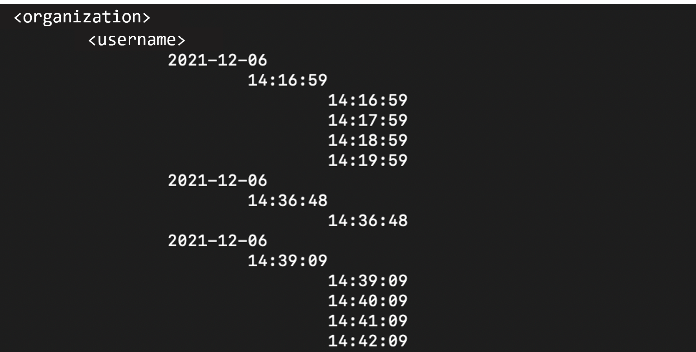
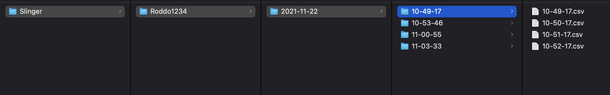

# Nextiles Data Documentation

This documentation contains information on the Bluetooth and CSV data structure, as well as ways to pull down data using provided python scripts

## Table of Contents

- [Nextiles Data Documentation](#nextiles-data-documentation)
  * [Data Structure](#data-structure)
    + [CSV](#csv)
    + [Metadata](#metadata)
  * [Product Types](#product-types)
    + [Arm & Knee Sleeve](#arm---knee-sleeve)
    + [Sock](#sock)
    + [Surface](#surface)
  * [Python Scripts](#python-scripts)
    + [Arguments](#arguments)
    + [Examples](#examples)
      - [Example 1 - `start_date`](#example-1----start-date-)
      - [Example 2 - `start_date` and `start_time`](#example-2----start-date--and--start-time-)
      - [Example 3 - `start_date` and `end_date`](#example-3----start-date--and--end-date-)
      - [Example 4 - `start_date`, `start_time`, and `end_time`](#example-4----start-date----start-time---and--end-time-)
      - [Example 5 - `start_date`, `end_date`, `end_time`](#example-5----start-date----end-date----end-time-)
      - [Example 6 - `start_date`, `start_time`, `end_date`, `end_time`](#example-6----start-date----start-time----end-date----end-time-)
    + [Error handling](#error-handling)

<!-- --------------------------------------- -->
<!-- PYTHON SCRIPTS -->
<!-- --------------------------------------- -->
## Data Structure

Data is stored by organization, username, and date / time of session. Date is written as `YYYY-MM-DD` and time as `HH:MM:SS` with the CSV files stored as `HH:MM:SS.csv` with incrementing time per duration of the session. Folder structure will appear as follows:

- **organization**/
    - **username**/
         - **start_date**/
            - **start_time**/
                - **csv_files_in_the _session**/

                

### CSV

CSV files follow a flat data structure in which every value comes with information on it's measurement, field, and type

| time | measurement | value | field | type | device |
|------|-------------|-------|-------|------|--------|
| YYYY-MM-DD HH:MM:SS:mmmm | [IMU, sensor, device, battery] | number | [ax, ay, az, gx, gy, gz, mx, my, mz, a[0-n], temp, humd, baro, b] | [acceleration, gyration, magnet, adc, temperature, humidity, barometer, battery] | device name |

Data heiarchy follows

| measurement | type         | field    | units              |
|-------------|--------------|----------|--------------------|
| IMU         | acceleration | a[x,y,z] | [m/s2]             |
| IMU         | gyration     | g[x,y,z] | [deg/s]            |
| IMU         | magnet       | m[x,y,z] | [tesla]            |
| sensor      | adc          | a[0-n]   | [N (uncalibrated)] |
| device      | temperature  | temp     | [Celcius]          |
| device      | humidity     | humd     | [%]                |
| device      | barometer    | baro     | [atm]              |
| battery     | battery      | bat      | [%]                |

<!-- - **IMU** > **acceleration** > **a[x, y, z]** - [m/s2] 
- **IMU** > **gyration** > **g[x, y, z]** - [deg/s]
- **IMU** > **magnet** > **m[x, y, z]** - [tesla]
- **sensor** > **adc** > **a[0-n]** - [N (uncalibrated)]
- **device** > **temperature** > **temp** - [Celsius]
- **device** > **humidity** > **humd** - [%]
- **device** > **barometer** > **baro** - [atm] -->

Example

| time                     | measurement | value | field | type         | device         |
|--------------------------|-------------|-------|-------|--------------|----------------|
| 2022-03-02 10:22:35:7600 | IMU         | 13    | ax    | acceleration | NX6db9e94987d8 |
| 2022-03-02 10:22:35:7600 | IMU         | 0     | ay    | acceleration | NX6db9e94987d8 |
| 2022-03-02 10:22:35:7600 | IMU         | 102   | az    | acceleration | NX6db9e94987d8 |
| 2022-03-02 10:22:35:7600 | IMU         | 115   | gx    | gyration     | NX6db9e94987d8 |
| 2022-03-02 10:22:35:7600 | IMU         | -103  | gy    | gyration     | NX6db9e94987d8 |
| 2022-03-02 10:22:35:7600 | IMU         | -57   | gz    | gyration     | NX6db9e94987d8 |
| 2022-03-02 10:22:35:7600 | IMU         | 210   | mx    | magnet       | NX6db9e94987d8 |
| 2022-03-02 10:22:35:7600 | IMU         | 329   | my    | magnet       | NX6db9e94987d8 |
| 2022-03-02 10:22:35:7600 | IMU         | 3748  | mz    | magnet       | NX6db9e94987d8 |
| 2022-03-02 10:22:35:7600 | sensor      | 19    | a0    | adc          | NX6db9e94987d8 |
| 2022-03-02 10:22:35:7600 | sensor      | 29    | a1    | adc          | NX6db9e94987d8 |
| 2022-03-02 10:22:35:7600 | sensor      | 17    | a2    | adc          | NX6db9e94987d8 |

### Metadata
Session metadata contains information about the user, session time, and device.

```javascript
{
  "organization" : "NBA",
  "data" : "1.0.0",
  "platform_version" : "iOS 15.3.1",
  "platform" : "iOS",
  "devices" : [
    {
      "device" : "NX6db9e94987d8",
      "device_placement" : "right_foot",
      "firmware" : "2.0.0",
      "product_type" : "SOCK"
    }
  ],
  "date" : "2022-03-02",
  "username" : "tryan",
  "time" : "10:22:35"
}
```

The device field is an array of device information containing the device name, product type (e.g. sock, sleeve), where it was placed (e.g. right arm, left leg), firmware. 

<!-- --------------------------------------- -->
<!-- PYTHON SCRIPTS -->
<!-- --------------------------------------- -->
## Product Types

All products contain IMU, sensor, device, and battery measurements. Each device emits packets of data at different frequencies. Each device may also contain different number of force sensors (1-n), as well as scalars that per device firmware.

### Arm & Knee Sleeve

**Sensors**
| Number of sensors | field |
|-------------------|-------|
| 1                 | a0    |

**Scalars**
| firmware_version | acceleration | gyration | magnet | adc | temperature | humidity | barometer |
|------------------|--------------|----------|--------|-----|-------------|----------|-----------|
| 0.0.1            | 100          | 100      | 100    | 1   | 10          | 1        | 1         |
| 1.0.0            | 100          | 100      | 100    | 1   | 10          | 1        | 1         |
| 2.0.0            | 100          | 100      | 10     | 1   | 10          | 10       | 100       |

### Sock

**Sensors**
| Number of sensors | field      |
|-------------------|------------|
| 1                 | a0, a1, a2 |

**Scalars**
| firmware_version | acceleration | gyration | magnet | adc | temperature | humidity | barometer |
|------------------|--------------|----------|--------|-----|-------------|----------|-----------|
| 0.0.1            | 100          | 100      | 100    | 1   | 10          | 1        | 1         |
| 1.0.0            | 100          | 100      | 100    | 1   | 10          | 1        | 1         |
| 2.0.0            | 100          | 100      | 10     | 1   | 10          | 10       | 100       |

### Surface

**Sensors**
| Number of sensors | field          |
|-------------------|----------------|
| 3                 | a0, a1, a2, a3 |

**Scalars**

IMU and device measurements are updated every 100 msec, as they are not relevant for this product.

| firmware_version | adc |
|------------------|-----|
| 0.1.1            | 1   |
| 0.1.2            | 1   |
| 0.2.2            | 1   |

<!-- --------------------------------------- -->
<!-- PYTHON SCRIPTS -->
<!-- --------------------------------------- -->
## Python Scripts

### Arguments

The mandatory arguments required to run the script are: 
- `--username` (`-u`)
- `--organization` (`-o`)
- `--token` (`-t`) 
- `--start_date` (`-s`)

Optional arguments include: 
- `start_time` (`-i`)
- `end_time` (`-j`)
- `end_date` (`-e`)

Special arguments:
- `ls` - prints files to the console, rather than download

**Time format**

The date formats will be YYYY-MM-DD (year-month-day). 

The time formats will be HH-MM-SS (hours-minutes-seconds). Hours are in military time (e.g. 2 PM is 14)

**Tokens**

Please inquire for an access token to grant permission to use the script and APIs.

### Examples

Downloading files

```bash
python3 download_s3_raw.py -u <username> -o <organization> -t <token> -s <YYYY-MM-DD> 
```

Listing files

```bash
python3  download_s3_raw.py -u <username> -o <organization> -t <token> ls
```

Note that a `start_time` and `end_time` can be added to narrow the printed list of files on the terminal

#### Example 1 - `start_date`

<!-- -s -->

To get data starting from 2021-12-06 (`--start_date` or `-s`)

```bash
python3 download_s3_raw.py -u <username> -o <organization> -t <token> -s 2021-12-06 
```

#### Example 2 - `start_date` and `start_time`

<!-- -s -i -->

To get data starting from 2021-12-06 after 14-16-59 (`--start_time` or `-i`) (i.e. 2:16 PM and 59 sec)

```bash
python3 download_s3_raw.py -u <username> -o <organization> -t <token> -s 2021-12-06 -i 14-16-59
```

#### Example 3 - `start_date` and `end_date`

<!-- -s -e -->

To get data between two dates starting from 2021-12-03 till 2021-12-06 (`--end_date` or `-e`)

```bash
python3 download_s3_raw.py -u <username> -o <organization> -t <token> -s 2021-12-03 -e 2021-12-06 
```

#### Example 4 - `start_date`, `start_time`, and `end_time`

<!-- -s -i -j -->

To get <username> session data from 2021-12-06 between 14-16-59 and 14-58-46 (`--end_time` or `-j`)
          
```bash
python3 download_s3_raw.py -u <username> -o <organization> -t <token> -s 2021-12-06 -i 14-16-59 -j 14-58-46 
```

#### Example 5 - `start_date`, `end_date`, `end_time`

<!-- -s -e -j -->

To get data starting from 2021-12-03 and before 2021-12-06 12-30-00

```bash
python3 download_s3_raw.py -u <username> -o <organization> -t <token> -s 2021-12-03     -j 12-30-00 -e 2021-12-06
```

#### Example 6 - `start_date`, `start_time`, `end_date`, `end_time`

<!-- -s -e -i -j -->

To get data between two dates starting from 2021-12-03 from 11-12-00 till 2021-12-06 08-20-12

```bash
python3 download_s3_raw.py -u <username> -o <organization> -t <token> -s 2021-12-03 -e 2021-12-06 -i 11-12-00 -j 08-20-12
```

### Error handling
1. If you see "**Nothing received**" error then there is either a typing error and you should check the username,organization,token has been entered correctly or the date for which you're requesting data has no data stored.
   
2. If you "**Too much data, error**" then try adding additional arguments to select a shorter time period for the dataset as shown above.
   
<!-- ### Example

```bash
python3  download_s3_raw.py -u Dr.Born -o Slinger -t <token> -s 2021-12-06 -i 14-16-59 -j 14-58-46  ls
```
This is the result of running the command above with your access `token` specified.


The result is structured as follows:

- **organization**/
    - **username**/
         - **start_date**/
            - **start_time**/
                - **files_in_the _session**/

The `start_time` is the session start_time or the time when you hit **start** on the app. The times within it `files_in_session` is your csv file recorded every minute until you hit **stop** on the app.

- The script will download the data if the `ls` argument is not specified at the end but if it is then your files will be listed. 

- Error will occur if you use **list** instead of `ls` -->

<!-- ## Data directory naming

After successfully running the script you will see a 'data' folder in the same directory where yoru script is. 


The data will be structured as follows:

- **data**/
    - **organization**/
        - **username**/
             - **start_date**/
                 - **start_time**/
                     - CSV file

    -->


