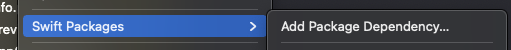
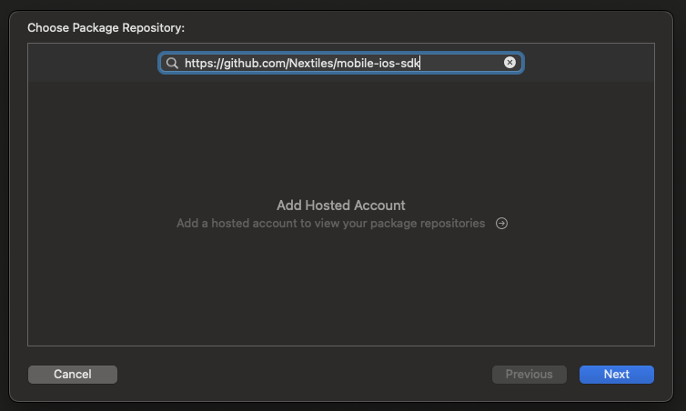
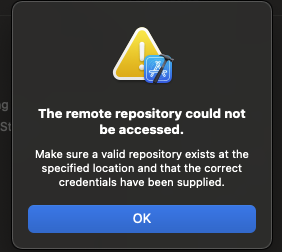
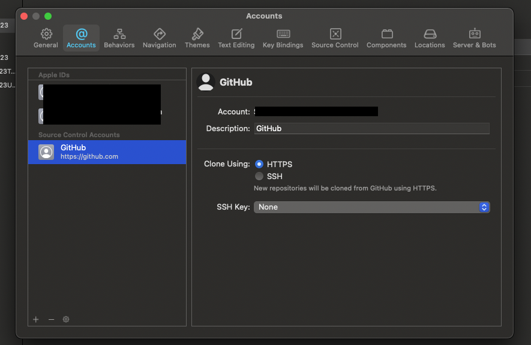
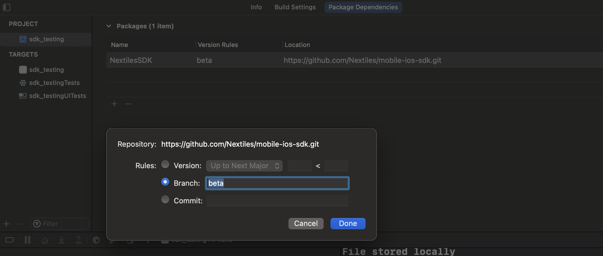
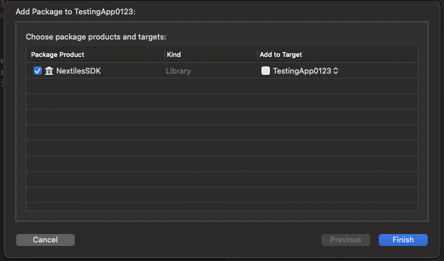
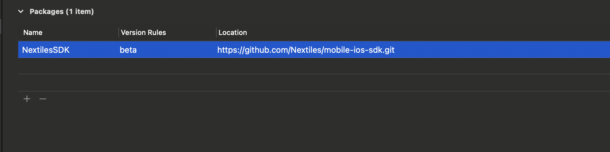

# NextilesSDK

Leverage the cutting edge Nextiles Technology, with Nextiles SDK and power your application with raw data stream. 

The following document talks about how to integrate the SDK in one's application. The document also provides a walkthrough on after installing the SDK; how to connect or disconnect a device, extract raw data and many other cool features.

Note: BLE Devices and the technology is out of this scope. You may want to read through [Bluetooth Connections](https://developer.apple.com/bluetooth/), if you want to dive deeper into it. 

### Features

### Platform Support

### License

### Terminologies

1. Connect
    - As the term says, this is when you connect a device, or establish a bluetooth connection with a BLE Device

2. Subscribe
    - This is done only when the device is connected. You cannot subscribe to a device which is not connected. Subscribe in this document means subscribing to a BLE device characteristics.

3. Unsubscribe
    - When user doesn't want to listen to the BLE device, but also doesn't want to disconnect. That's where we need to do Unsubscribe.

4. Disconenct
    - When user want to disconnect a connected device.

5. Characteristics
    - Consider Characteristics as data points which you can listen to, of a Nextiles device. NextilesSDK acts as a wrapper and provides raw, calculated data points for, acceleration, gyration, pressure, torque, etc.

6. TIME_INTERVAL
    - is a time interval which decides if the data should be stored in a CSV and create a new CSV to accomodate the live data stream. It's an interval by which SDK breaks the CSVs 
 
7. Nextiles Parameters
    Nextiles Parameters are the field types or features which a Nextiles Device can track. To make it easier for clients, we have made these specific definitions.     And these are:    
    - NEXTILES_BATTERY
    - NEXTILES_ACCELERATION
    - NEXTILES_GYRATION
    - NEXTILES_MAGNET
    - NEXTILES_ANGULAR
    - NEXTILES_ENVIRONMENT
    
    This would be useful in Step 5. Live Data Stream in [**Use NextilesSDK and it's features**](###Use-NextilesSDK-and-it's-features)

### Install Nextiles SDK via SPM (Swift package manager)

1. Swift Package Manager is distributed with Xcode. To start adding the Nextiles SDK to your iOS project, open your project in Xcode and select File > Swift Packages > Add Package Dependency. Note:- XCode is at 12.5, at the time of this document.



2. Enter the Github repo URL (https://github.com/Nextiles/mobile-ios-sdk/) into the search bar and click Next.




3. You'll see a window for **Account** and **Token**. Nextiles' SDK Repository is private and hence you would need the token to be able to leverage the SDK. Need not to worry cause you will get that token from us. Use your github account for `account` and the token which we'll provide in `token`. And click **Next**


Note:- If you see an error: "The remote repository could not be accessed" then it's possibly cause of the already attached 
Github account to your XCode. Current git configuration doesn't have the token in it.



If you'd go to your menu XCode > Preferences > Account, you'll see the github account/or a Git account there. 


A fix is to remove that account and try from the step 1 again and this time XCode will prompt you for the **Account** and **Token**


4. You'll see the SDK repo rules for which version of SDK you want Swift Package Manager to install. Choose the second rule, branch, as it will try to leverage the dev branch (currently, as we're on the beta stage for the SDK, we'll select this), then click Next.




5. NextilesSDK should be automatically selected as it's the only package in this repo. Click **Finish**




6. You can always go back and modify which SPM packages are included in your project by opening the Swift Packages tab for your project: Click on the **Project** file in the **Xcode navigator**, then click on your project's icon, then select the **Swift Packages** tab.




7. In your app code, explicitly import NextilesSDK and test the SDK like this:
``` Swift
import SwiftUI
import NextilesSDK

struct ContentView:View{
    var sdk = NextilesSDK()
    var body:some View{
      MainViewComponent()
    }
}

```

### Device struct and other definitions:
We provide a Nextiles Device struct for you to interact with a device. This struct gives you access to device's UUID, address, name and several other features. For your convinience, we're going to define the structure here:
``` Swift

    public struct Device{
        public let name: String
        public let id: UUID
        public var address: String?
        public var rssi: Int? = nil
        public var connected: Bool = false
    }
    
```
So, now if you have a device object, you can easily access its features. 
For ex: to get the device's name: ```deviceObject.name```, to get device's UUID: ```deviceObject.id```, in string format ```deviceObject.id.uuidString```.
#### NextilesDeviceType
In our SDK, you will need to define what type of device one is and the device which you are trying to connect and that's where NextilesDeviceType structure comes handy. 
NextilesDeviceType has:
``` 
    1. SLEEVE
    2. KNEEBRACE
    3. SOCK
    4. MAT
    
```
so you can use it as: ```NextilesDeviceType.SLEEVE```, ```NextilesDeviceType.KNEEBRACE```, ```NextilesDeviceType.SOCK```, ```NextilesDeviceType.MAT```

### Use NextilesSDK and it's features
Now that the SDK is available for use, it's time to see how we can use it.
NextilesSDK comes with many features and some of them are:

1. One time Registration:

2. Scanning:
    You can scan the nearby/discoverable Nextiles devices, by using ```startScan() ``` function.
    ##### Usage/Example:
    ``` Swift
        import SwiftUI
        import NextilesSDK
        ...
        
        var sdk = NextilesSDK()
        sdk.startScan() // can be done on a button click or any other event you like
        ...
        
     ```
    To get the list of devices, use SDK's ```getPeripherals()``` function.
    It returns a [@Published](https://developer.apple.com/documentation/combine/published) **Device** List (any change in the list, makes your UI reload automatically). 

    ##### Usage/Example :
    ``` Swift
        var sdk = NextilesSDK()

        ...
        
        {
            List{
                    ForEach(sdk.getPeripherals(),id:\.id){
                        device in
                            HStack{
                               Text(device.name)
                                Spacer()
                        }
                    }
            }
        }
           
    ```
Here, ```getPeripherals()``` returns the list of devices which are discoverable and as is visible in the above snippet, we can access device attributes as well.

3. Connecting  
 - To connect a device, use SDK's ``` connectDevice(device:Device,device_type:String) ``` function, which takes two parameters: device and device_type, where device is of Device struct, and device_type is a String. 
 - You can check if the device is connected by using, ``` getConnectedDevicesListInDeviceForm ``` function. The following function returns a @Published list, which you can attach a listener to, so as soon as the device is connected it updates all its subscribers.

##### Usage/Example:
``` Swift

import SwiftUI
import NextilesSDK

@EnvironmentObject var sdk:NextilesSDK
@Binding var device:Device?

struct DummyView: View {
    var body: some View {
      Text("Hello World")
            .onChange(of: sdk.getConnectedDevicesListInDeviceForm(), perform: { value in
            
            // here value is a list of all the connectedDevices, in case if you're trying to connect multiple devices.
            // you can have your own logic to see if the list contains the device or not
            
                value.forEach{ _device in
                    if _device.id == self.device?.id{
                    
                        // Now the device is connected, you can subscribe to it (shown in step 4.), or do your after connection logic
                        print("Device is connected")
                    
                    }
                }
            })
    }
  }
  
```
As shown in the above example, ```sdk.getConnectedDevicesListInDeviceForm()``` makes our life easier by providing a @Published list, so we don't have to worry about re-rendering the UI.

**Also, another thing to note here is, NextilesSDK instance is being stored in an EnvironmentObject, as it helps us initialize it once and avoid inconsistencies**

4. Subscribe/Reading Data

Once the device is connected, we are ready to read the data and for that we will subscribe to the device's characteristics. To subscribe and start reading the data we will use ``` subscribeCharacteristics(device:Device) ``` function, which takes Device object as an argument. While the device is being subscribed, our SDK reads the data emitted by the device and all of that data would be stored as soon as we stop (unsubscribe or disconnect) or the TIME_INTERVAL exceeds.

####Usage:
```
# in the above example, we can use this function like:

var body:some View{
    Button(action:{
        sdk.subscribeCharacteristics(self.device!)
    }){
        Text("Subscribe")
    }
}
```
To check if the device is subscribed, you can use SDK's ``` getSubscribedDevices() ``` function, which returns a dictionary of [String:Bool], where key will be the device's UUID (in String format) and value is True or False. Similar to ``` getPeripherals() ```, this also publishes an event which you can listen to. If a device is subscribed or unsubscribed, it reflect the change. 

####Usage:
```
VStack{
    Text("Hello")
    }.onChange(of: sdk.getSubscribedDevices(), perform: { value in
                        // where value is a dictionary of [String:Bool]

                        if value.contains(self.device.id.uuidString){
                            print(" Device Subscribed ")
                        }
    })
}
```
Now that we have subscribed to the device, the data reading is real. Nextiles Device is emitting data, the SDK is reading and storing it in your application's local storage (Documents folder). If internet connection is on, it's also uploading data to the cloud, to maintain a copy of that data. To see the data follow next steps.

5. Live Data Stream
This is where the Nextiles SDK becomes more powerful, where not only the data is being stored in CSV formats but also this SDK provides you **Publisher** handles to which you can attach a listener and see the data in real time. You can plot real time charts on top of this data.

You can use ``` getDeviceListeners(_ device_id:String, _ feature: String) ``` function, which takes two arguments:
    -  device_id: Device's UUID in String format
    -  feature: the feature you want to listen to, like "acceleration", "gyration", "angular", etc.
    
####Usage:
```
    VStack{
      ...
    }.onReceive(sdk.getDeviceListeners(device!.id.uuidString, NEXTILES_ACCELERATION){ value in
       let acceleration_x = value[0] // at 0th index, acceleration at x axis
       let acceleration_y = value[1] // at 1th index, acceleration at y axis
       let acceleration_z = value[2] // at 2nd index, acceleration at z axis
    }
```


6. Unsubscribe/ Generating CSVs
Unsubscribing is more like a pause event in a play-pause-stop cycle. When the user is tired and doesn't want to track the data or just want a break, that's when we will use SDK's ``` unsubscribeCharacteristics(device:Device) ``` function, which takes Device object as an argument. Use this function to stop listening to the Nextiles Device. 

SDK takes care of generating the CSVs on behalf of us.
#### Local Storage Structure

1. NEXTILES-NotUploaded
    - This is the local storage where if the file isn't uploaded on the cloud or when there is no internet connection. SDK will initially store this file here

2. NEXTILES-Uploaded
    - Nextiles Uploaded will ideally have all of your sessions data. CSVs in here are the files which are being already uploaded on cloud (which our SDK takes care of)
