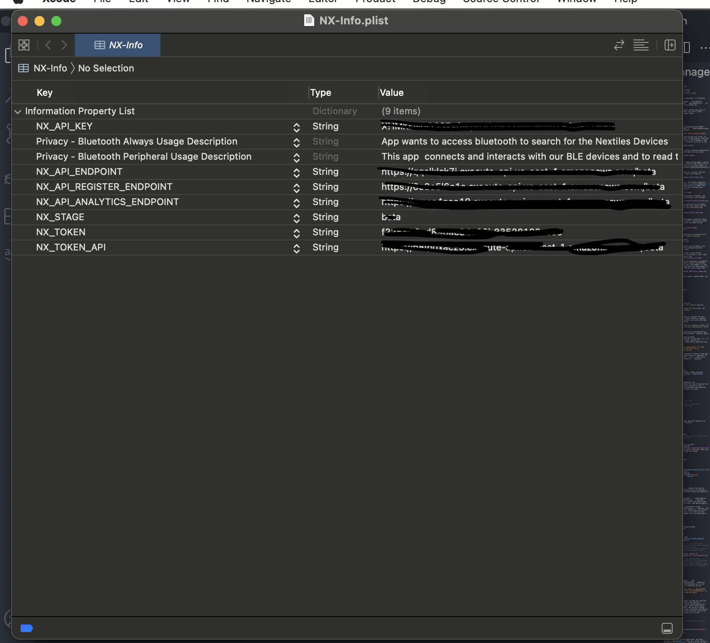

## NextilesSDK

Leverage the cutting edge Nextiles Technology, with Nextiles SDK and power your application with raw data stream.

The following document describes how to integrate the SDK into an application, how to connect or disconnect a device, extract raw data and many other exciting features.

**Note**: BLE devices and Bluetooth Technology is out of this document's scope. Read more about [Bluetooth Connections](https://developer.apple.com/bluetooth/), if needed.

## Table of Contents
- [NextilesSDK](#nextilessdk)
- [Table of Contents](#table-of-contents)
- [Platform Support](#platform-support)
- [Terminologies](#terminologies)
- [Device struct and other definitions:](#device-struct-and-other-definitions)
  - [NextilesDeviceType](#nextilesdevicetype)
- [Install Nextiles SDK via SPM (Swift package manager)](#install-nextiles-sdk-via-spm-swift-package-manager)
- [Use NextilesSDK and it's features](#use-nextilessdk-and-its-features)
    - [Usage/Example:](#usageexample)
- [Nextiles API Documentation](#nextiles-api-documentation)


## Platform Support
-   ios 11.0 or higher
-   Package uses Swift5.3

## Terminologies

1. Connect
    - when trying to establish a bluetooth connection with the Nextiles device.

2. Subscribe
    - Subscribe, in this document refers to, subscribing to a Nextiles device's characteristics. Subscribtion to a device, which is not connected, is not allowed. This is done only after the device is connected.

3. Unsubscribe
    - Unsubscribe, refers to, unsubscribing from the device's characteristics. Remember, the device would still be connected, unless disconnected.

4. Disconenct
    - Disconnecting, refers to, disconnect an already connected device.

5. Characteristics
    - Consider characteristics as metrics of a Nextiles device, which SDK can listen to. NextilesSDK acts as a wrapper over these characteristics and provides raw, calculated metrics for acceleration, gyration, pressure, torque, etc.

6. TIME_INTERVAL
    - is a time interval which decides if the data should be stored in a CSV. It's a time interval by which SDK splits the CSVs and maintains the file size. By default it's set to  `180 SECONDS`

7. Nextiles Metrics
    Nextiles Metrics are the parameters which a Nextiles Device can track and emitt. To make it easier for users, following specific definitions are provided:
    - NEXTILES_BATTERY
    - NEXTILES_ACCELERATION
    - NEXTILES_GYRATION
    - NEXTILES_MAGNET
    - NEXTILES_ANGULAR
    - NEXTILES_ENVIRONMENT

    Read More about it, in `Step 5. Live Data Stream` in [**Use NextilesSDK and it's features**](###Use-NextilesSDK-and-it's-features)

## Device struct and other definitions:
We provide a Nextiles Device struct for you to interact with a device.
Nextiles SDK provide a struct: `Device` to interact with a NX (Nextiles) device. This struct gives access to a device's UUID, address, name, etc. For convinience, let's mention the definition of the structure here:

``` Swift
    public struct Device{
        public let name: String
        public let id: UUID
        public var address: String?
        public var rssi: Int? = nil
        public var connected: Bool = false
    }
```
So, now if a device object is available, its features could be easily accessed.
For ex: to get the device's name: ```deviceObject.name```, to get device's UUID: ```deviceObject.id```, in string format ```deviceObject.id.uuidString```.

### NextilesDeviceType
In the SDK, there'll be a need to define what type of device user is trying to connect and that's where `NextilesDeviceType` struct comes handy.
NextilesDeviceType has:
```
    1. SLEEVE
    2. KNEE
    3. SOCK
    4. SURFACE
```
so it's usage is like: ```NextilesDeviceType.SLEEVE```, ```NextilesDeviceType.KNEE```, ```NextilesDeviceType.SOCK```, ```NextilesDeviceType.SURFACE```

## Install Nextiles SDK via SPM (Swift package manager)

1. Swift Package Manager is distributed with Xcode. To start adding the Nextiles SDK to an iOS project, open the project in Xcode and select File > Swift Packages > Add Package Dependency. **Note**:- XCode is at 12.5, at the time of this document.


2. Enter the Github repo URL (https://github.com/Nextiles/mobile-ios-sdk/) into the search bar and click Next.

    


3. Sign in to Github account window should appear, asking for **Account** and **Token**. Nextiles SDK Repository is private and hence there's a need of an access token, to leverage the SDK. Need not to worry cause Nextiles will provide that token. 

    Use the github account name for `account` and the access token for `token`. And click **Next**

    


    Note:- If there's an error: "The remote repository could not be accessed" then it's possibly cause of the already attached Github account in XCode. And it's failing because current git configuration doesn't have the token in it.

    

    Go to the menu XCode > Preferences > Account, and there should be a github account/or a Git account visible.
    

    If that's the case, then a quick fix is to remove that account and try from the step 1 again and this time XCode will prompt for the **Account** and **Token**
    
    


4. SDK repo rules window should appear asking for which version of SDK, Xcode should install. Choose the second rule, `branch`, as it will try to leverage the dev branch, then click Next.

    


5. NextilesSDK should be automatically selected as it's the only package in this repo. Click **Finish**

    


6. To list the SPM packages which are included in the project, navigate to the list by opening the Swift Packages tab for the project like: 

    Click on the **Project** file in the **Xcode navigator**, then click on the project's icon, then select the **Swift Packages** tab.


7. NX-Info.plist file, provided by Nextiles is needed to be able to use the SDK. If didn't receive the NX-Info.plist then reach out to one of our Team member. If the NX-Info.plist is available then make sure the project is able to build properly. <br> NX-Info.plist looks like this:



8. In your app code, explicitly import `NextilesSDK` and test the SDK like this:

    ``` Swift
    import SwiftUI
    import NextilesSDK

    struct ContentView:View{
        var sdk = NextilesSDK()
        var body:some View{
        MainViewComponent()
        }
    }

    ```

## Use NextilesSDK and it's features
Now that the SDK is available, it's time to see how exactly to use it.
Usually, these would be the steps (in this order, but also depends on the implementation):

1. **One time Registration**:

   To connect to a Nextiles Device, register the user with Nextiles first. This request tries to register the user within Nextiles servers and stores the User data in the user's application.

   Use `registerUser()` function to **login** as well. If it matches the credentials it will successfully return the login object.

   To do this, use SDK's `registerUser(username:String,role_type:String,organization:String)` function, which takes 3 arguments:
   -    username, is the unique username,
   -    role_type, is the role_type of the user, i.e., if it's a Tester, Developer, Guest, Athlete etc.,
   -    Organization, is the organization which the user is connected to.

    **Username is unique, per organization. It's not possible to have two same usernames in an organization.(At least for now)**

    Use ```sdk.getUser()``` function to check if the user is being set or if the registration is required. If ```sdk.getUser()``` returns ```nil```, then we'll need to invoke ```registerUser()``` function.

    #### Usage/Example:
    ```Swift
        import SwiftUI
        import NextilesSDK
        ...
        var sdk = NextilesSDK()
        sdk.registerUser(username: 'dummy_username', role_type: 'dummy_role_name', organization: 'dummy_organization')
        ...
    ```

    Now, that the user is registered, use
    ``` sdk.getUser() ``` function to see if the user has being set. If the user hasn't been set in the ```getUser()``` then the NextilesSDK functionality (like connecting a device) can't be used.

    #### Usage/Example:

    ``` Swift
    VStack{
        if sdk.getUser(){
            // continue your use-case
        }else{
            // call registerView or invoke sdk.registerUser(...) function
            RegisterView()
        }
    }
    ```


2. **Scanning**:

    Scan the nearby/discoverable Nextiles devices, by using ```startScan() ``` function.
    #### Usage/Example:
    ``` Swift
        import SwiftUI
        import NextilesSDK
        ...

        var sdk = NextilesSDK()
        sdk.startScan() // can be done on a button click or any other event you like
        ...

    ```
    To get the list of devices, use SDK's ```getPeripherals()``` function.
    It returns a [@Published](https://developer.apple.com/documentation/combine/published) **Device** List (any change in the list, makes your UI reload automatically).

    #### Usage/Example :
    ``` Swift
        var sdk = NextilesSDK()

        ...

        {
            List{
                    ForEach(sdk.getPeripherals(),id:\.id){
                        device in
                            HStack{
                            Text(device.name)
                                Spacer()
                        }
                    }
            }
        }

    ```
    Here, ```getPeripherals()``` returns the list of devices which are discoverable and as is visible in the above snippet, we can access device attributes as well.

3. **Connecting**  
    - To connect a device, use SDK's ``` connectDevice(device:Device,device_type:String) ``` function, which takes two parameters: device and device_type, where device is of Device struct, and device_type is a String.
    - Check if the device is connected by using, ``` getConnectedDevicesListInDeviceForm ``` function. The following function returns a @Published list, which you can attach a listener to, so as soon as the device is connected it updates all its subscribers.

   #### Usage/Example:
   ``` Swift

   import SwiftUI
   import NextilesSDK

   @EnvironmentObject var sdk:NextilesSDK
   @Binding var device:Device?

   struct DummyView: View {
       var body: some View {
         Text("Hello World")
               .onChange(of: sdk.getConnectedDevicesListInDeviceForm(), perform: { value in

               // here value is a list of all the connectedDevices, in case if you're trying to connect multiple devices.
               // you can have your own logic to see if the list contains the device or not

                   value.forEach{ _device in
                       if _device.id == self.device?.id{

                           // Now the device is connected, you can subscribe to it (shown in step 4.), or do your after connection logic
                           print("Device is connected")

                       }
                   }
               })
       }
     }

   ```
   As shown in the above example, ```sdk.getConnectedDevicesListInDeviceForm()``` makes our life easier by providing a @Published list, so we don't have to worry about re-rendering the UI.

   **Also, another thing to note here is, NextilesSDK instance is being stored in an EnvironmentObject, as it helps us initialize it once and avoid inconsistencies**

4. **Subscribe/Reading Data**

    Once the device is connected, the SDK can read the data and for that subscribe to the device's characteristics. Use ``` subscribeCharacteristics(device:Device) ``` function, which takes Device object as an argument. While the device is being subscribed, SDK reads the data emitted by the device and all of that data would be stored as soon as we stop (unsubscribe or disconnect) or if the TIME_INTERVAL exceeds.

    #### Usage/Example:
    ```Swift
    // in the above example, we can use this function like:

    var body:some View{
        Button(action:{
            sdk.subscribeCharacteristics(self.device!)
        }){
            Text("Subscribe")
        }
    }
    ```
    To check if the device is subscribed, use SDK's ``` getSubscribedDevices() ``` function, which returns a dictionary of [String:Bool], where key will be the device's UUID (in String format) and value is True or False. Similar to ``` getPeripherals() ```, this also publishes an event which we can listen to. If a device is subscribed or unsubscribed, it reflect the change.

    #### Usage/Example:
    ``` Swift
    VStack{
        Text("Hello")
        }.onChange(of: sdk.getSubscribedDevices(), perform: { value in
                            // where value is a dictionary of [String:Bool]

                            if value.contains(self.device.id.uuidString){
                                print(" Device Subscribed ")
                            }
        })
    }
    ```
    Now that we have subscribed to the device, the data reading is getting real. Nextiles Device is emitting data, the SDK is reading and storing it in application's local storage (Documents folder). If internet connection is on, it's also uploading data to the cloud, to maintain a copy of that data. To see the data in a live stream, follow next steps.

5. **Live Data Stream**

    This is where the Nextiles SDK becomes more powerful, where not only the data is being stored in CSV formats but also this SDK provides **Published Objects** handles to which one can easily attach a listener and see the data in real time. Realtime charts can be plotted on this live stream feed.

    Use ``` getDeviceListeners(_ device_id:String, _ feature: String) ``` function, which takes two arguments:
        -  device_id: Device's UUID in String format
        -  feature: the metric you want to listen to, like "acceleration", "gyration", "angular", etc.

    #### Usage/Example:
    ``` Swift
        import Swift
        import NextilesSDK

        {
            VStack{

                ...

            }.onReceive(sdk.getDeviceListeners(device!.id.uuidString, NEXTILES_ACCELERATION){ value in
                let acceleration_x = value[0] // at 0th index, acceleration at x axis
                let acceleration_y = value[1] // at 1th index, acceleration at y axis
                let acceleration_z = value[2] // at 2nd index, acceleration at z axis
            }
        }
    ```
    ### More Information on Metrics
    All these metrics returns a [PassthroughSubject](https://developer.apple.com/documentation/combine/passthroughsubject) in a **[String]** format.
    -   NEXTILES_BATTERY

        shows the device's battery. Expect this value to be a list of count 1.
    -   NEXTILES_ACCELERATION

        returns the calculated acceleration at any given time. Expect this to be a list of count 3 and of format `[ax, ay, az]`, where:

        - ax is the acceleration in x axis,
        - ay is the acceleration in y axis,
        - az is the acceleration in z axis

    - NEXTILES_GYRATION

    returns the calculated gyration at any given time. Expect this to be a list of count 3 and of format `[gx, gy, gz]`, where:

        -  gx is the gyration in x axis,
        -  gy is the gyration in y axis,
        -  gz is the gyration in z axis
    - NEXTILES_MAGNET

        returns the calculated gyration at any given time. Expect this to be a list of count 3 and of format `[mx, my, mz]`, where:

        -  mx is the magnet in x axis,
        -  my is the magnet in y axis,
        -  mz is the magnet in z axis

    - NEXTILES_ANGULAR

        returns the calculated angular at any given time. Expect this to be a list of count 1 and of format `[a0]`, where:

        -  a0 is angular rotation

    - NEXTILES_ENVIRONMENT

        returns the calculated environment parameters at any given time. Expect this to be a list of count of 3 and of format `[temp, hum, alt]`, where:

        -   temp stands for Temperature
        -   hum stands for  Humidity
        -   alt stands for  Altitude


6. **Unsubscribe/ Generating CSVs**

    Unsubscribing is more like a pause event in a play-pause-stop cycle (when the user is tired or doesn't want to track the data). Use SDK's ``` unsubscribeCharacteristics(device:Device) ``` function, which takes Device object as an argument. Use this function to stop listening to the Nextiles Device.

    SDK takes care of generating the CSVs on behalf of us.

    ### Local Storage Structure

    1. NEXTILES-NotUploaded
        - This is the local storage where if the file isn't uploaded on the cloud or when there is no internet connection. SDK will initially store this file here

    2. NEXTILES-Uploaded
        - Nextiles Uploaded will ideally have all of your sessions data. CSVs in here are the files which are being already uploaded on cloud (which Nextiles SDK takes care of)
    

7. **Disconnect Device**

    Disconnecting the device is as easy as connecting. Use SDK's `disconnectDevice(device:Device)` function, which takes one argument of Device type Object.

    #### Usage/Example:

    ``` Swift
    import SwiftUI
    import NextilesSDK

    @Binding var device:Device

    struct Someview: some View{
        var sdk = NextilesSDK()
        ...

        sdk.disconnectDevice(self.device)

        ...
    }

    ```
    And now after disconnecting, use `sdk.getConnectedDevicesListInDeviceForm` function to verify if the device is disconnected. It's the same method mentioned above to check if the device is no longer available in the list.


## Nextiles API Documentation
Nextiles API gives you a way to fetch data stored in cloud. [Read More](https://github.com/Nextiles/documentation/blob/master/software/api-documentation.md)
