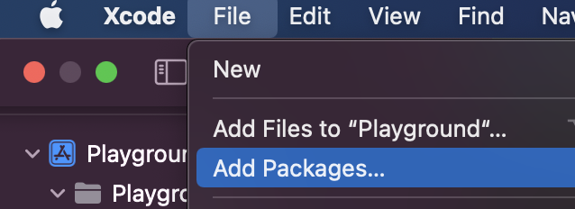
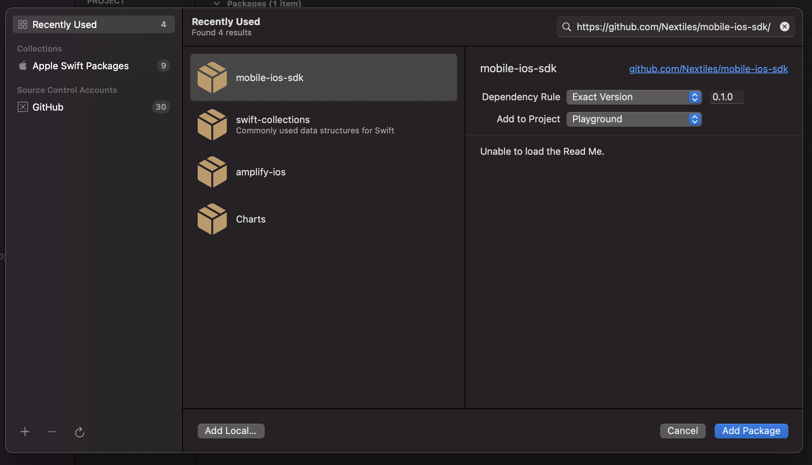
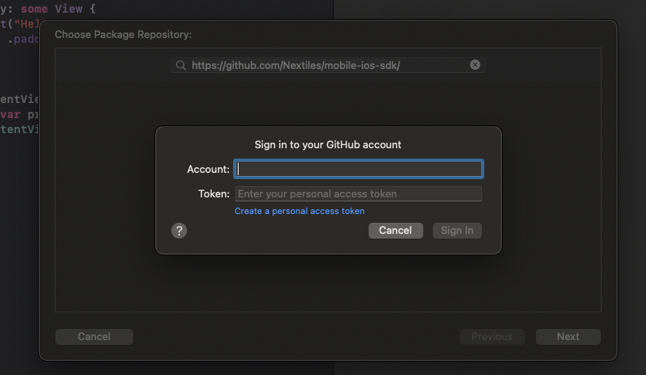
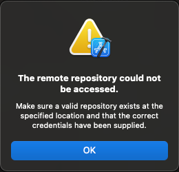
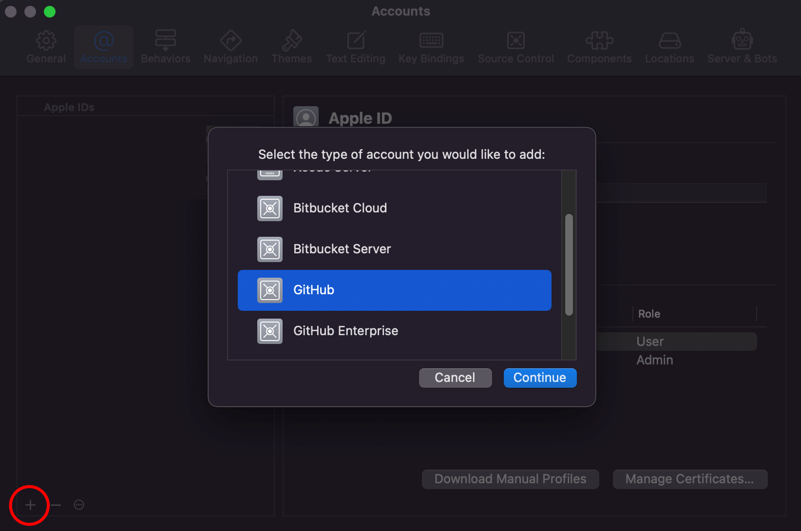
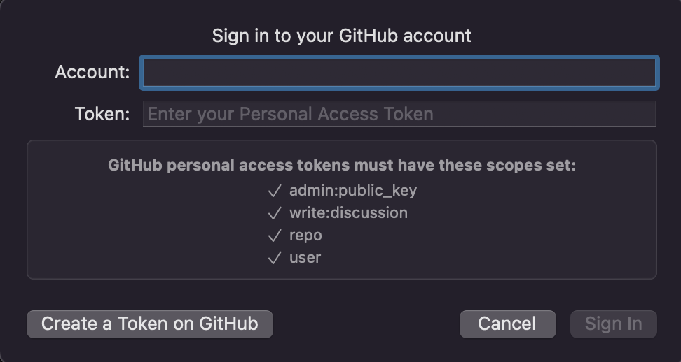
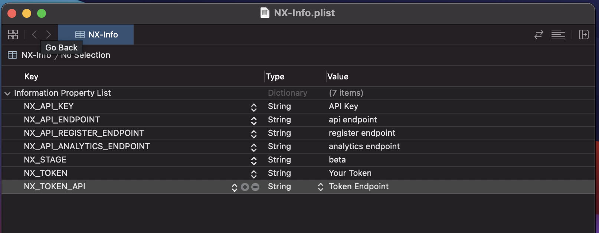
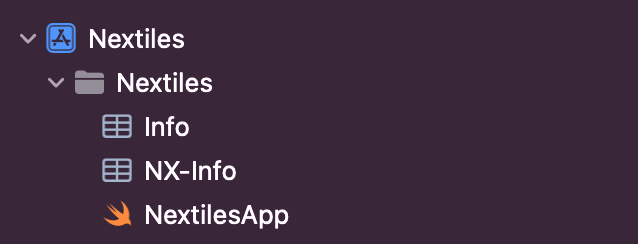

# NextilesSDK
Thank you for choosing to use the Nextiles SDK. Using this SDK will allow you to communicate with our devices. You will be able to connect/disconnect and have live data streamed, to your iOS devices. The SDK will grant access to our analytics which takes raw data and provides insight into user sessions. 

## Table of Contents
* [Installation Process](#installation-process)
    * [Installation Steps](#installation-steps)
    * [Troubleshooting](#troubleshooting)
* [Info Plist](#info-plist)
* [Getting started with the SDK](#getting-started-with-the-sdk)
* [User](#user)
    * [Registering a new user](#registering-a-new-user)
    * [Login a user](#login-a-user)
    * [Logout current user](#logout-current-user)
    * [Get current user](#get-current-user)
    * [Edit a user](#edit-a-user)
* [Bluetooth Connectivity](#bluetooth-connectivity)
    * [Initiate scanning / stop scanning](#start-and-stop-scanning)
    * [Getting discovered Nextiles devices](#getting-discovered-nextile-devices)
    * [Connecting to a Nextiles device](#connecting-to-a-nextiles-device)
    * [Disconnecting from a Nextiles device](#disconnecting-from-a-nextiles-device)
    * [Update the devices firmware](#device-firmware-update)
* [Sessions](#sessions)
    * [Starting a session](#starting-a-session)
    * [Stopping a session](#stopping-a-session)
* [Getting Raw Data](#getting-raw-data)
    * [Getting access to a device's PassthroughSubject](#getting-access-to-pts-for-a-specific-device)
    * [Raw data getters](#raw-data-getters)
* [Getting Analytics](#getting-analytics)
    * [Get recent data](#get-recent-data)
* [Classes and Structs](#classes-and-structs)
    * [Device class](#device-class)
        * [Setting custom names](#setting-custom-name-for-devices)
    * [Session class](#session-class)
    * [Summary class](#summary-class)
    * [Peaks class](#peaks-class)
    * [User class](#user-class)
    * [Measurement class](#measurement-class)
* [Delegates and Protocols](#delegates-and-protocols)

## Installation Process

The NextilesSDK is distributed using [Swift Package Manager](https://www.swift.org/package-manager/).

### Installation Steps
1. In your Xcode project click File -> Add Packages

2. A popup will appear asking you to choose an existing Apple Library or to search for other libraries.
3. To use this SDK simply in the search bar paste: "`https://github.com/Nextiles/mobile-ios-sdk/`"
4. In the dependency rule option you will choose the `exact version` option. The version to use will be "`0.1.0`"
5. Click the `Add Package` button in the bottom right corner of the pop up. 
 
6. Lastly another popup will appear asking you to confirm access to our private repository. Simply enter your Github handle and the token that will be provided to you. 


### Troubleshooting
Sometimes you may run into `the remote repository could not be accessed`



To resolve this issue you need to add Nextiles credentials to your accounts in your Xcode's system preference.
1. Go to your Xcode's system preferences.
2. Click the plus icon in the bottom left.
3. Choose `GitHub` as your account type.


Finally:
- In the `Sign in to your Github Account` popup enter the account `accounts@nextiles.tech`
- Enter the token provided to you.
- Click sign in.
- Installation should proceed with no issues. 


## Info Plist

An NX-Info.plist file, provided by Nextiles is needed to be able to use the SDK. Without this file, the SDK will not work. Simply drag and drop the NX-Info file into your application's file hierarchy to finish the installation and setup process of the SDK.






## Getting started with the SDK

```swift
//Import the NextilesSDK package
import NextilesSDK

class myApplication {
    //Initialize the SDK with your organization
    var sdk = NextilesSDK(organization: "Nextiles") { success in
        if success {
            print("SDK ready to use!")
        }
        else {
            print("SDK not initiliazed, functions will not work")
        }
    }
}
```


**ARGUMENTS**
- `organization` - the name of the organization linked to the token the user is using. 

**RETURN**
- `Bool` - true or false depending on if the organization and token match our backend.

**ERROR**
* `False`, token is not valid
* `False`, organization name does not correspond with the token provided


**DESCRIPTION** <br>
Initializing the SDK using your organization. 

## User


### Registering a new user
```swift
// Creating a new user
let newUser = User(username: "NewUser", organization: "Nextiles")

//Calling the sdk to register the new user
sdk.registerUser(user: newUser) { success in
    if success {
        print("Registration successful")
     }
    else {
        print("Registration unsuccessful")
    }
}
```

**ARGUMENTS**
- [user](#user-class)

**RETURN**
- `Bool` - true or false depending on if the registration was successful.

**ERROR**
- `False`, the user was already registered

**DESCRIPTION** <br>
Registering a new user.

**Note**
- Successful registration will set the current user in local storage.
- Using user setters before registration will add the user's metadata to the backend for better analysis of their data.

**Example**
```swift
// Creating a new user
let currentUser = User(username: "NewUser", organization: "Nextiles")

    newUser.setHeight(height: 70)
    newUser.setAge(age: 22)
    newUser.setCountry(country: "united-states")
    newUser.setHand(hand: "right")
        
    sdk.registerUser(user: newUser) { success in
            
        if success {      
            print("User successfully registered with metadata")
        }
        else {
            print("Registration unsuccessful")
        }
    }
```

### Login a user

```swift
//Creating the current user
let currentUser = User(username: "currentUser", organization: "Nextiles")
        
//Using the sdk to attempt login
sdk.loginUser(user: currentUser) { success in
    if success {
        print("User has successfully logged in")
    }
    else {
        print("User has did not logged in")
    }
}
```

**ARGUMENTS**
- [user](#user-class)

**RETURN**
- `Bool` - true or false depending on if the login attempt was successful.

**ERROR**
- `False`, the user does not have an existing account in the backend

**DESCRIPTION** <br>
Logging in a current user. 

**Note**
- Successful login attempts will set the current user in local storage with their metadata provided in the registration process. 

### Logout current user

```swift
//logout the current user
sdk.logoutUser()
```

**RETURN**
- `Bool` - true or false depending on if the logout attempt was successful.

**ERROR**
- `False`, user SDK initialization failed, so access to the SDK was not granted. 

**DESCRIPTION** <br>
Logout the current user. 

**Note**
- This method unsets the current user in local storage. 

### Get current user

```swift
//get the current user in local storage
if let currentUser = sdk.getUser() {
    print(currentUser.username)
}
```

**RETURN**
- [user?](#user-class) - optional user becuase a user may not be set in local storage

**ERROR**
- If no user is set in local storage, the return value will be nil so the returend user needs to be unwrapped. 

**DESCRIPTION** <br>
Getting the current user that has been set after a succesful login or registration attempt.

### Edit a user

```swift
//get the current user in local storage
if let currentUser = sdk.getUser(){
    //update the user's age
    currentUser.setAge(age: 40)
            
     //update the user in the backend
    sdk.editUser(user: currentUser) { success in
        if success {
            print("User has been editited")
        }
        else {
            print("Could not edit the user")
        }
    }
}
```

**ARGUMENTS**
- [user](#user-class)

**RETURN**
- `Bool` - true or false depending on if the edit attempt was successful.

**ERROR**
- `False`, the user does not have an existing account in the backend

**DESCRIPTION** <br>
Edit a user. 

**Note**
- Successful edit attempts will set the locally stored user with the updated data. 

## Bluetooth Connectivity

### Start and stop scanning

```swift
//start scanning
sdk.startScan()
        
//stop scanning
sdk.stopScan()
```

**DESCRIPTION** <br>
Start / stop discovering Nextile devices.

**Note**
- You need to start scanning to discover nextile devices. 
- Stop scanning purpose is to save the bandwidth of your application, by preventing the SDK from always scanning and affecting the performance of your app.

### Getting Discovered Nextile Devices

```swift
//get access to all discovered devices
let discoveredDevices = sdk.getDiscoveredDevices()
//Printing each device's name
for device in discoveredDevices {
     print(device.name)
}
```

**RETURN**
- [[Device](#device-class)] - Array of devices that were discovered while scanning.

**ERROR**
- No devices were found because the user did not start scanning. 

**DESCRIPTION** <br>
Get all discovered devices found while scanning.

**Note**
- Since Bluetooth connectivity is an asynchronous process that is not controllable we provide [delegates](#delegates-and-protocols) to inform users when a device has been discovered. 
- The SDK is an ObservableObject and therefore can be used as a published or StateObject variable to update your UI when devices have been discovered.

### Connecting to a Nextiles Device

```swift
//get a device from the discovered devices array
if let connectingDevice = sdk.getDiscoveredDevices().first {
    //Get the desired connecting settings for the chosen device
    let userChosenSettings = DeviceSettings(placement: .right_arm, device_type: .sleeve)
    //Call the SDK to connect to the chosen device using the desired settings
    sdk.connectDevice(device: connectingDevice, settings: userChosenSettings)
}
```

**ARGUMENTS**
- [device](#device-class)
- `settings` - required data needed to connect.

**RETURN**
- Use the delegate method deviceGotConnected to be notified when the device connection was successful.

**DESCRIPTION** <br>
Connecting to a Nextiles device.

**Note**
- Based on your desired workflow, the SDK provides three additional ways to connect to a device. 

**Example**
```swift
let deviceSettings = DeviceSettings(placement: .right_foot, device_type: .sock)
        
 //connecting using the device's name
let deviceName = "myDeviceName"
 sdk.connectDevice(deviceName: deviceName, settings: deviceSettings)
        
 //connecting using the device's UUID
let deviceUUID = UUID()
sdk.connectDevice(uuid: deviceUUID, settings: deviceSettings)
        
//connecting using the UUID string
sdk.connectDevice(uuid: deviceUUID.uuidString, settings: deviceSettings)
```

### Disconnecting from a Nextiles Device

```swift
//get a device from connected device array
if let disconnectDevice = sdk.getConnectedDevices().first {
    //Use the SDK to disconnect from the Nextile's device
    sdk.disconnectDevice(device: disconnectDevice)
}
```

**ARGUMENTS**
- [device](#device-class)

**RETURN**
- Use the delegate method deviceGotDisconnected to be notified when a Nextile's device got disconnected.

**DESCRIPTION** <br>
Disconnecting from a Nextiles device.

**Note**
- Based on your desired workflow, the SDK provides three additional ways to disconnect from a device. 

**Example**
```swift
 //disconnecting using the device's name
let deviceName = "myDeviceName"
 sdk.disconnectDevice(deviceName: deviceName)
        
 //disconnecting using the device's UUID
let deviceUUID = UUID()
sdk.disconnectDevice(uuid: deviceUUID)
        
//disconnecting using the UUID string
sdk.disconnectDevice(uuid: deviceUUID.uuidString)
```

### Device firmware update
```swift
//get a connectedDevice
if let connectedDevice = sdk.getConnectedDevices().first{
    sdk.updateDeviceFirmware(device: connectedDevice)
}
```

**Return**
- To know the status of the firmware update implement the Bluetooth delegate functions `firmwareUpdate` and `firmwarePercentageUpdate`

**ERROR**
- Device is not connected, bluetooth issues.
- Zip file is not saved locally in the application. 
- Deivice is not a Nextiles 200 device. 

**DESCRIPTION** <br>
Update the firmware of a Nextiles device.

**Note**
- The device must be connected
- The device must be a Nextiles 200 device.
- The firmware of the device must be saved in your project's hierarchy in Xcode.

## Sessions

Now that you have connected to our devices, you can start reading data. To start reading data you must start a session:

### Starting a Session

```swift
//starting a session
let sessionTimestamp = sdk.startSession()
```
**Return**
- `Optional String` - returned is the timestamp of the session. 

**ERROR**
- No connected devices to start a session.
- No user set in local storage. 
- SDK not initialized. 

**DESCRIPTION** <br>
Starting a session. 

```swift
//starting a session with a session length of 15 seconds instead of the default minute
let sessionTimestamp = sdk.startSession(sessionDuration: 15)
```
**Return**
- `Optional String` - returned is the timestamp of the session. 

**ERROR**
- No connected devices to start a session.
- No user set in local storage. 
- SDK not initialized. 

**DESCRIPTION** <br>
Starting a session, however defining the length of sessions or the speed in which CSV files are uploaded. 

**Note**
- A session is the moment you start an activity until the moment you complete your activity. 
- During this period, we read the raw data from all of your connected devices.
- You must have a currently logged-in user to start a session.

### Stopping a Session

```swift
//stopping the current session
sdk.stopSession() as String?
```
**RETURN**
- `String` - returned is the session timestamp of the session you just stopped. You can use these timestamps to get analytics about your session.

**ERROR**
- No session started to stop.

**DESCRIPTION** <br>
Stopping a session. 

**Note**
- Stopping a session will stop listening to for connected device's raw data.
- At this point stopping a session will upload all of your raw data to the cloud that has not done so already. 
- You can call "sdk.stopSession as Void" if you don't want the timestamp.
- It is highly recommended to complete `uploadSurvey()` function at this point to get the best analytics. 

## Getting Raw Data

Raw data is streamed when a user starts a [session](#sessions). We have provided access to the raw data being streamed using [PassthroughSubjects](https://developer.apple.com/documentation/combine/passthroughsubject) (PTS). You can access these PTS using the getDeviceListener method:

### Getting access to PTS for a specific Device
```swift
//getting access to a Nextiles Device
if let myDevice = sdk.getDevice(deviceName: "My Device"){
//Getting the force raw datastream for a particular device
sdk.getDeviceListener(device: myDevice, measurement: .NEXTILES_FORCE)
}
```

**ARGUMENTS**
- [device](#device-class)
- `measurement` - enum to make it easier to see all of the measurement options to choose from using dot notation.  

**RETURN**
- PassthroughSubject? - optional PTS because the Device may not exist.

**DESCRIPTION** <br>
Getting a PTS for a particular device and measurement. 

**Note**
- Now that you have the PTS all you have to do is subscribe/listen for published changes produced by our devices. 
- Based on your desired workflow, the SDK provides three additional ways to get a device's PTS. 

**Example**
```swift
//using a device's name to get the acceleration PTS
let myDeviceName = "DeviceName"
sdk.getDeviceListener(deviceName: myDeviceName, measurement: .NEXTILES_ACCELERATION)
        
//using a device's UUID to get the gyration PTS
let myDeviceUUID = UUID()
sdk.getDeviceListener(uuid: myDeviceUUID, measurement: .NEXTILES_GYRATION)
        
//using a device's UUID as a string to get the enviornment PTS
sdk.getDeviceListener(uuid: myDeviceUUID.uuidString, measurement: .NEXTILES_ENVIRONMENT)
```

### Raw data getters

```swift
//Getting the most recent force data streamed using the device class
if let myDevice = sdk.getDevice(deviceName: "My Device") {
    sdk.getForce(device: myDevice)
}
        
//Using the device's name to get the most recent force data
let deviceName = "MyDevice"
sdk.getForce(deviceName: deviceName)
        
//Using the device's UUID to get the most recent force data
let deviceUUID = UUID()
sdk.getForce(uuid: deviceUUID)
        
//Using the device's UUID string to get the most recent force data
sdk.getForce(uuid: deviceUUID.uuidString)        
```
**ARGUMENTS**
- Your preferred method to identify a device

**RETURN**
- Optional [Measurement](#measurement-class), because there may have been no data streamed as of yet.

**DESCRIPTION** <br>
Get the most recent data that has been streamed for a particular device and metric.

**Note**
- Returned is the most recent data not the stream of data. 
- As data is being streamed, these measurements are being updated. 
- There are getters for each Measurement. 

## Getting Analytics

```swift
//Timestamp of a session that i performed an activity
        let myCurrentSessionTimeStamp = "2022-01-01 01:01:01"
        //getting the current user from local storage
        if let currentUser = sdk.getUser(){
            sdk.getSession(
                user: currentUser,
                timeStamp: myCurrentSessionTimeStamp) { success, returnedSession in
                    //Api call was made succesfully
                    if success {
                        //unwrapping analytics returned
                        if let sessionData = returnedSession {
                            print(sessionData.activity)
                            print(sessionData.peaks)
                            print(sessionData.session_summary)
                            print(sessionData.duration)
                        }
                    }
                }
        }
```
**ARGUMENTS**
- [user](#user-class)
- `timestamp` of session you would like analytics for

**RETURN**
- `Bool` - true or false depending on if the API call was made successfully.
- [Session](#session-class) - returned analytics class

**ERROR**
- `False`, the user does not exist
- `False`, the timestamp for a valid user does not exist

**DESCRIPTION** <br>
Getting analytics for a particular user's session time stamp.

**Note**
- You can get the timestamp for a currently started session by calling "stopSession() as? String". This function will stop the current session and return the timestamp.
- You can also get all the timestamps for a specific user by using the "getUserSessions()" function.
- The last timestamp in the array returned is the user's most recent session time stamp. 

**Example**
```swift
//getting the current user in local storage
if let currentUser = sdk.getUser(){
    //calling the sdk to get all of the user's timestamp
    sdk.getUserSessions(user: currentUser) { success, sessionTimeStamps in
        //api called was made succesfully
        if success {
            //Loop through all of the user's session time stamps
            for session in sessionTimeStamps {
                print(session)
            }
        }
    }
}

```

### Get Recent Data
```swift
    if let currentUser = sdk.getCurrentUser(){
        //Get analytics for the most recent file uploaded
        getRecentData(user: currentUser, timeStamp: nil) { success, fileData in
            if success{
                print(fileData?.session_summary?.torque)
            }
        }
    }
```
**ARGUMENTS**
- [user](#user-class)
- `timestamp` of the file you would like to get analytics for

**RETURN**
- `Bool` - true or false depending on if the API call was made successfully.
- [Session](#session-class) - returned analytics class

**DESCRIPTION** <br>
Getting analytics for a specific file. You do not have to wait for a stop session as compared to `getSession`

**Note**
- `timestamp` is optional meaning it can be set to nil
    - if timestamp is set to nil you are requesting analytics for the most recent file uploaded
    - if the timestamp is just a date, you are requesting analytics for the most recent file uploaded for that specific date
    - if the the timestamp provided is a full valid timestamp, you are requesting analytics for that specific file


## Classes and Structs


### Device class
- Properties
    - `name`: (String) - name of the device
    - `id`: (UUID) - id of the device
    - `uuidString` (String) - id of the device as a string
    - `userCustomName`(Optional String)- custom name set by the user
    - `placement`(Optional String) - where the device has been placed on the user
    - `device_type`(Optional String) - what type of product the user indicated the device to be
    - `firmware_version` (Optional String) - firmware of device determined when getting the device’s information while connecting. 
    - `connected` (Optional String) - wheter the device is connected or not.
    - `subscribed` (Optional String) - whether the device is subscribed to or not.

### Methods Specific for the device class

### GetDevice


```swift
//get a specific device using a device object
//can use device stored in local storage
let selectedDevice = Device(name: "UserSelectedDevice", id: UUID())
 sdk.getDevice(device: selectedDevice)

//get a device using its name
let nameOfDevice = "selected device"
sdk.getDevice(deviceName: nameOfDevice)

//get a device using its UUID        
let deviceUUID = UUID()
sdk.getDevice(uuid: deviceUUID)
//get a device using its UUID as a string        
sdk.getDevice(uuid: deviceUUID.uuidString)
```
**ARGUMENTS**
- `device`: device 
- or `deviceName`: String
- or `uuid`: UUID
- or `uuid`: String

**RETURN**
- `device?` - optional because this device may not have been discovered yet

**ERROR**
- `nil` - device has not been discovered

**DESCRIPTION** <br>
Returns a specific discovered device. 

**Note**
- This device returned can be used to connect, or disconnect.

### Setting custom name for devices

```swift
//getting access to a device
if let userDevice = sdk.getDevice(deviceName: "Nextiles1"){

    //setting custom name for the device
    sdk.setDeviceCustomName(device: userDevice, name: "Setting Custom Name")
}
```

**ARGUMENTS**
- `device` - the device that the user would like to set a custom name.
- `name` (String) - the name the device should be set to.

**DESCRIPTION** <br>
Add a custom name for a specific device.

**Note**
- The methods set the property `userCustomName`
- This name is stored in the local storage of the phone. 
- This function can be used to change the custom name. 
- To delete the custom name you have to use `deleteDeviceCustomName(device: Device)`

### Saving devices to local storage

```swift
//get access to a device
if let deviceWantToSave = sdk.getDevice(deviceName: "Nextiles2"){
    //save the device to local storage
    sdk.addDeviceToLocalStorage(device: deviceWantToSave)
}

//getting the stored device from local storage
if let userSavedDevice = sdk.getDeviceFromLocalStorage(uuid:"Device UUID as string"){
    print (userSavedDevice.name)
    print(userSavedDevice.firmware_version)
}
 ```

 **ARGUMENTS**
- `device` - the device that the user would like to save to the device's local storage.
**DESCRIPTION** <br>
Saves a device object to local storage. Best to use if you would like to easily access and reuse the settings for a device.

**Note**
- This device returned cannot be used to connect because there is no peripheral linked to this device.
- Please use the `getDevice(device:Device)` method to get the discovered device and then proceed to connect. 
- To remove a device from local storage you can use the method: `removeDeviceFromLocalStorage(device: Device)`

### Session class
- Properties
    - `timestamp` (String) - the session timestamp the analytics api was requeted to analyze. 
    - `duration` (String) - the duration of the session. Start time to end time in seconds.
    - `activity` (String) - the activity being performed by the user during their session.
    - [session_summary](#summary-class) - summary of the session
    - [peaks](#peaks-class) - summary of each peak detected in the session

### Summary class
- Properties
    - `force`
        - scaled_min: Float
        - scaled_mean: Float?
        -  scaled_max: Float?
        - raw_min: Float?
        - raw_mean:Float?
        - raw_max:Float?
    - `power`
        - same values as `force`
    - `torque`
        - same values as `force`
    - `work`
        - same values as `force`

### Peaks class
- Properties
    - `force`: Float? - raw force value of a peak
    - `work`: Float? - raw work value of a peak
    - `power`: Float? - raw power value of a peak
    - `torque`: Float? - raw torque value of a peak
    - `raw_time`: String? - time of the peak
    - `time_elapsed`: Float? - amount of seconds that have passed since starting a session 
    - `rep`: String? - the rep number

### User class
- Properties
    - `username` - registered username for the user
    - `organization` - registerd organization for the user
    - `name` - name set at registration
    - `height` - height set at registration 
    - `country` - country set at registration
    - `hand` - handedness set at registration
    - `foot` - footedness set at registration
    - `dob` - date of birth set at registration

### Measurement class
- Properties
    - `force`:
        - values - an array of force values. 0th position being the a0 value. nth position in the array being the aNth value.
    - `battery`
        - charge - the most recent charge level returned by the device.
    - `environment` 
        - temperature - the most recent temperature returned by the device.
        - humidity - the most recent humidity returned by the device.
        - altitude - the most recent altitude returned by the device.
    - `acceleration`
        - x - most recent x value for a device's accleation measurement
        - y - most recent y value for a device's accleation measurement
        - z - most recent z value for a device's accleation measurement
     - `gyration`
        - x - most recent x value for a device's gyration measurement
        - y - most recent y value for a device's gyration measurement
        - z - most recent z value for a device's gyration measurement
    - `magnet`
        - x - most recent x value for a device's magnet measurement
        - y - most recent y value for a device's magnet measurement
        - z - most recent z value for a device's magnet measurement

## Delegates and Protocols

The SDK primarily uses [protocols and delegates](https://docs.swift.org/swift-book/LanguageGuide/Protocols.html) to communicate to end-user Bluetooth updates. To listen for Bluetooth updates set a class as the delegate to our `bleProtocols`.

```swift
class SimpleClass{
    
    //Init sets this class as the bleDelegate
    //Meaning this class will listen for all published ble events
    init () {
        //Setting this class as the delegate
        NextilesDelegates.bleDelegate = self
    }
}

//Conforming to the bleProcols in an extension
extension SimpleClass: bleProtocols {
    
    //This function will be triggered any time a device has been connected succesfully
    //You will be given the recently connected device as an argument
    func deviceGotConnected(device: Device) {
    }
    
    //This function will be triggerd any time a new device has been discovered
    //You will be given an array of devices that are currntly disovered but not connected
    func discoveredDevices(devices: [Device]) {
    }
    
    //This function will be triggered anytime a device has been sucessfully disconnected
    //You will be given the recently disconnected device as an argument
    func deviceGotDisconnected(device: Device) {
    }
    
    //This function will be triggered everytime the firmware of a deivce has been discovered
    //Will alawys follow after deviceGotConnected protocol method
    func firmwareDiscovered(device: Device) {
    }
}
```

**Note**
- User should wait until after firmwareDiscovered is triggered to start a session. 