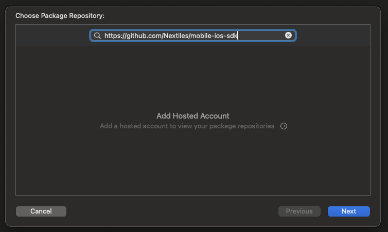
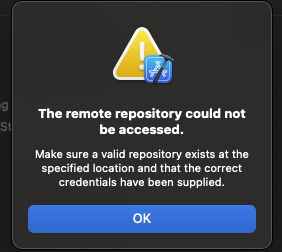
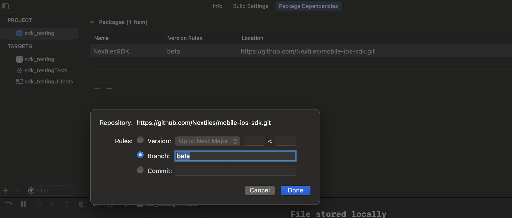
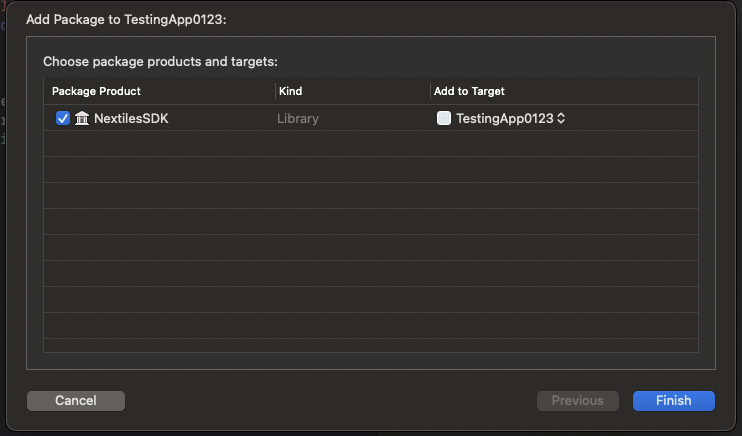

## NextilesSDK

Leverage the cutting edge Nextiles Technology, with Nextiles SDK and power your application with raw data stream.

The following document describes how to integrate the SDK into an application, how to connect or disconnect a device, extract raw data and many other exciting features.

**Note**: BLE devices and Bluetooth Technology is out of this document's scope. Read more about [Bluetooth Connections](https://developer.apple.com/bluetooth/), if needed.

## Table of Contents
- [NextilesSDK](#nextilessdk)
- [Platform Support](#platform-support)
- [Install Nextiles SDK via SPM](#install-nextiles-sdk-via-spm)
- [Terminologies](#terminologies)
  * [Device struct and other definitions:](#device-struct-and-other-definitions-)
  * [Nextiles Device Types](#nextiles-device-types)
- [Use NextilesSDK and it's features](#use-nextilessdk-and-it-s-features)
    + [User attributes](#user-attributes)
    + [Delegate](#delegate)
    + [More Information on Metrics](#more-information-on-metrics)
- [Nextiles API Documentation](#nextiles-api-documentation)

## Platform Support
-   ios 13.0 or higher
-   Package uses Swift5.3

## Install Nextiles SDK via SPM

1. Swift Package Manager is distributed with Xcode. To start adding the Nextiles SDK to an iOS project, open the project in Xcode and select File > Swift Packages > Add Package Dependency. **Note**:- XCode is at 12.5, at the time of this document.


2. Enter the Github repo URL (https://github.com/Nextiles/mobile-ios-sdk/) into the search bar and click Next.

    

3. Sign in to Github account window should appear, asking for **Account** and **Token**. Nextiles SDK Repository is private and hence there's a need of an access token, to leverage the SDK. Need not to worry cause Nextiles will provide that token.

    Use the github account name **Nextiles** for `account` and the access token for `token`. And click **Next**

    


    Note:- If there's an error: "The remote repository could not be accessed" then it's possibly cause of the already attached Github account in XCode. And it's failing because current git configuration doesn't have the token in it.

    

    Go to the menu XCode > Preferences > Account, and there should be a github account/or a Git account visible.
    

    If that's the case, then a quick fix is to remove that account and try from the step 1 again and this time XCode will prompt for the **Account** and **Token**

    

4. SDK repo rules window should appear asking for which version of SDK, Xcode should install. Choose the second rule, `branch`, as we will use the `beta` branch, then click Next.

    

5. NextilesSDK should be automatically selected as it's the only package in this repo. Click **Finish**

    

6. To list the SPM packages which are included in the project, navigate to the list by opening the Swift Packages tab for the project like:

    Click on the **Project** file in the **Xcode navigator**, then click on the project's icon, then select the **Swift Packages** tab.


7. NX-Info.plist file, provided by Nextiles is needed to be able to use the SDK. If didn't receive the NX-Info.plist then reach out to one of our Team members. If the NX-Info.plist is available then make sure the project is able to build properly. <br> NX-Info.plist looks like this:


8. In your app code, explicitly import `NextilesSDK` and test the SDK like this:

    ``` Swift
    import SwiftUI
    import NextilesSDK

    struct ContentView:View{
        var sdk = NextilesSDK(organization:"<YourOrganizationname>"){result in
            // if result is not true then all good else trouble for us
            if result{
                print("SDK Verified")
            }else{
                print("Cannot use SDK and it will fail")
            }
        }
        var body:some View{
        MainViewComponent()
        }
    }

    ```
Here NextilesSDK(organization:"`YourOrgName`") is the initializer which verifies internally and also does most of the heavy lifting for us. `YourOrgName` is the organization name which Nextiles has registered your organization with. This could be found in the NX-Info.plist file to double-check the typos.

## Terminologies

1. Connect
    - when trying to establish a bluetooth connection with the Nextiles device.

2. Subscribe
    - Subscribe, in this document refers to, subscribing to a Nextiles device's characteristics. Subscribtion to a device, which is not connected, is not allowed. This is done only after the device is connected.

3. Unsubscribe
    - Unsubscribe, refers to, unsubscribing from the device's characteristics. Remember, the device would still be connected, unless disconnected.

4. Disconenct
    - Disconnecting, refers to, disconnect an already connected device.

5. Characteristics
    - Consider characteristics as metrics of a Nextiles device, which SDK can listen to. NextilesSDK acts as a wrapper over these characteristics and provides raw, calculated metrics for acceleration, gyration, pressure, torque, etc.

6. TIME_INTERVAL
    - is a time interval which decides if the data should be stored in a CSV. It's a time interval by which SDK splits the CSVs and maintains the file size. By default it's set to  `180 SECONDS`

7. Nextiles Metrics
    Nextiles Metrics are the parameters which a Nextiles Device can track and emitt. To make it easier for users, following specific definitions are provided:
    - NEXTILES_BATTERY
    - NEXTILES_ACCELERATION
    - NEXTILES_GYRATION
    - NEXTILES_MAGNET
    - NEXTILES_ANGULAR
    - NEXTILES_ENVIRONMENT

    Read More about it, in `Step 5. Live Data Stream` in [**Use NextilesSDK and it's features**](###Use-NextilesSDK-and-it's-features)

### Device struct and other definitions:
We provide a Nextiles Device struct for you to interact with a device.
Nextiles SDK provide a struct: `Device` to interact with a NX (Nextiles) device. This struct gives access to a device's UUID, address, name, etc. For convinience, let's mention the definition of the structure here:

``` Swift
    public struct Device{
        public let name: String
        public let id: UUID
        public var address: String?
        public var rssi: Int? = nil
        public var connected: Bool = false
    }
```

So, now if a device object is available, its features could be easily accessed.
For ex: to get the device's name: ```deviceObject.name```, to get device's UUID: ```deviceObject.id```, in string format ```deviceObject.id.uuidString```.

### Nextiles Device Types
In the SDK, there'll be a need to define what type of device user is trying to connect and that's where `NextilesDeviceType` struct comes handy.
NextilesDeviceType has:
```
    1. SLEEVE
    2. KNEE
    3. SOCK
    4. SURFACE
```

so it's usage is like: ```NextilesDeviceType.SLEEVE```, ```NextilesDeviceType.KNEE```, ```NextilesDeviceType.SOCK```, ```NextilesDeviceType.SURFACE```

### NextilesDelegates
SDK provides delegates which are accessible via NextilesDelegates class.
Some delegates and the protocols which are available in this class are:
1. `bleDelegate:bleProtocols?`
2. `authDelegate:userAuthCallback?`
3. `uploadDelegate:uploadDataAWSProtocols?`
4. `analyticsDelegate:analyticsProtocol?`

    `bleProtocols` has functions:
    - `func deviceFullyConnected(devices:[Device])`, gets triggered when the a device gets connected. This also returns a list of devices in return which makes it easier for multiple device connection
    - `func sessionStarted(value:Bool)`, gets triggered when the session is started. 
    - If its `true`, means session has started
    - If its `false`, means session has stopped
    - `func fileStoredLocally(value:Bool)` is triggered when the data is stored locally while being in a session. 
    - `func deviceGotDisconnected(device:Device)` is triggered when the device is disconnected. It returns the `device`.

    `analyticsProtocol`
    - `func getAnalyticsData(data:[String:[String:Any]])`
    - `func getSessionList(sessionList:[String])`
    - `func gotError(error:Error)`
    These are the functions which are used to get the data analytics from the NextilesAPI. Following functions help in providing metrics for a particular session.

    `userAuthCallback`    
    - `func registeredSuccessfully(user:User)` gets triggered when a registration process happens successfully.
    - `func loginSuccessfully(user:User)` gets triggered when a login is successfull

    `uploadDataAWSProtocols`
    - `func uploadedDataToAWS(sessionTime:String)` gets triggered when an upload to the SDK backend happens

    #### Usage of the delegates:-
    To be able to listen to the delegates, we have to assign these delegates to self. So, in Swift5, this could be done as:-
    ```Swift
    init(){
        NextilesDelegates.bleDelegate = self
        NextilesDelegates.uploadDelegate = self
    }
    ...
    ```
    And then implement the stubs as requested by Xcode

## Use NextilesSDK and it's features
Now that the SDK is available, it's time to see how exactly to use it.
Usually, these would be the steps (in this order, but also depends on the implementation):

1. **User class**:

   SDK provides a User class interface by which a User can be defined and be passed along in the system.
   User initializer looks like:
   `User(username:String,organization:String)`

   #### User attributes
   All of these attributes here are *optional and not mandatory*. Nextiles provides these attributes to various clients to power the data science.
   - Date of birth, set the dob by calling `user.setDob(dob:String)`
   - Gender, set the gender by calling `user.setGender(gender:String)`
   - Weight, set the weight by calling `user.setWeight(weight:Int)`
   - Height, set the height by calling `user.setHeight(height:Int)`
   - Country, set the country by calling `user.setCountry(country:String)`
   - Name, set the name by calling `user.setName(name:String)`
   - Handed, set the the left or right side dominant for hand by calling `user.setHand(hand:String)`
   - Footed, set the left or right side dominant foot by calling `user.setFoot(foot:String)`
   - Sport and skillset, set the sport and skill set by calling `user.setSportAndSkillSet(sport:String,skillset:String)`

    **Example**
    ```Swift
    import SwiftUI
    import NextilesSDK

    let user  = User(username:"dummyUsername",organization:"dummyUserOrganization")
    // setting few properties for the User
    user.setWeight(160)
    user.setGender("Male")
    user.setHeight(240)
    ```

2. **Registration**:

   To connect to a Nextiles Device, register the user with Nextiles first. This request tries to register the user within Nextiles servers and stores the User data in the user's application.

   Use `registerNextilesUser()` function to **register** . If it matches the credentials it will successfully return the login object.

   To do this, use SDK's `sdk.registerNextilesUser(user: User, completion: (Bool) -> ())` function, which takes 2 arguments:
   -    user, is an object of User class,

   -    completion is a callback which returns a Bool value
        - If *true*, registered successfully
        - If *false*, registration failed

    **Username is unique, per organization. It's not possible to have two same usernames in an organization (at least for now)**

    **Example**
    ```Swift
    import SwiftUI
    import NextilesSDK

    var sdk = NextilesSDK(organization:"Nextiles"){...}

    @State var isRegistered = False

    let user = User(username: "jdBatman", name: "John Doe", organization: "Wayne Enterprises")
    user.setName(name:"Bruce Wayne")
    sdk.registerNextilesUser(user:user){ result  in
                if result{
                    // Registeration successfull
                    isRegistered = True
                }else{
                    // Registration failed
                    isRegistered = False
                }
    }
    ...
    ```
    If registration is successfull, user is stored in the SDK and by using function ```sdk.getUser()```, User could be retrieved.


    At any point in time, use ```sdk.getUser()``` function to check if the user is set or if the registration is required. If ```sdk.getUser()``` returns ```nil``` no user is stored yet and is recommended to register or login first.


    **Example**

    ``` Swift

    @State var isUserAvailable = False

    VStack{
        if sdk.getUser(){
            isUserAvailable = True
            // take me to the Dashboard
        }else{
            // call registerView or invoke sdk.registerUser(...) function
            isUserAvailable = False
            RegisterView()
        }
    }
    ```
    NextilesSDK also provides delegate ```registeredSuccessfully(user:User)``` from ```userAuthCallback``` protocol and hence could be used like this:-

    ``` Swift
    extension DummyClass:userAuthCallback{
        func registeredSuccessfully(user: User) {
            print("User got registered:- ",user)
        }    
    }
    ```
    This delegate gets fired if the registration is successfull.

3. **Login**:

    To login the user for NextilesSDK, use ```loginNextilesUser(user:User,completion:(Bool)->())``` function.

    The following function takes 2 arguments:
    - **user**, is the User object
    - **completion callback**, which returns True or False, where:
      - True, stands for successfull login
      - False, stands for unsuccessfull login

    <br/>
    
    **Example**

    ```Swift
    @State var isLoggedIn = False
    let user = User(username:"dummyUser",organization:"dummyOrganization")
    func loginUser(){
        sdk.loginNextilesUser(user:user){result in
                if result{
                    isLoggedIn = True
                }else{
                    isLoggedIn = False
                }
        }
    }
    ```

    Similarly ```sdk.getUser()``` could be used here to check if the user is in the SDK session
<br/><br/>

    NextilesSDK also provides delegate ```loginSuccessfully(user:User)``` from ```userAuthCallback``` protocol and hence could be used like this:-

    ``` Swift
    extension DummyClass:userAuthCallback{
        func loginSuccessfully(user: User) {
            print("User got registered:- ",user)
        }    
    }
    ```
    This delegate gets fired if the login is successfull.

4. **Scanning**:

    Scan the nearby/discoverable Nextiles devices, by using ```startScan() ``` function.
    **Example**
    ``` Swift
        import SwiftUI
        import NextilesSDK
        ...

        var sdk = NextilesSDK()
        sdk.startScan() // can be done on a button click or any other event you like
        ...

    ```
    To get the list of devices, use SDK's ```getPeripherals()``` function.
    It returns a [@Published](https://developer.apple.com/documentation/combine/published) **Device** List (any change in the list, makes your UI reload automatically).

    #### Usage/Example :
    ``` Swift
        var sdk = NextilesSDK()

        ...

        {
            List{
                    ForEach(sdk.getPeripherals(),id:\.id){
                        device in
                            HStack{
                            Text(device.name)
                                Spacer()
                        }
                    }
            }
        }

    ```
    Here, ```getPeripherals()``` returns the list of devices which are discoverable and as is visible in the above snippet, we can access device attributes as well.

5. **Connecting**  
    - To connect a device, use SDK's ```connectDevice(device:Device,device_type:String) ``` function, which takes two parameters: device and device_type, where device is of Device struct, and device_type is a String.
      - where device, is the device object class which is easily available in `sdk.getPeripherals()`
      - where device_type, could be SLEEVE, KNEEBRACE, SURFACE or SOCK
    - Check if the device is connected by using, ``` getConnectedDevicesListInDeviceForm ``` function. The following function returns a @Published list, which you can attach a listener to, so as soon as the device is connected it updates all its subscribers.

   **Example**
   ``` Swift

   import SwiftUI
   import NextilesSDK

   @EnvironmentObject var sdk:NextilesSDK
   @Binding var device:Device?

   struct DummyView: View {
       var body: some View {
         Text("Hello World")
               .onChange(of: sdk.getConnectedDevicesListInDeviceForm(), perform: { value in

               // here value is a list of all the connectedDevices, in case if you're trying to connect multiple devices.
               // you can have your own logic to see if the list contains the device or not

                   value.forEach{ _device in
                       if _device.id == self.device?.id{

                           // Now the device is connected, you can subscribe to it (shown in step 4.), or do your after connection logic
                           print("Device is connected")

                       }
                   }
               })
       }
     }

   ```
   As shown in the above example, ```sdk.getConnectedDevicesListInDeviceForm()``` makes our life easier by providing a @Published list, so we don't have to worry about re-rendering the UI.

   #### Delegate
    DeviceFullyConnected is the delegate which could be used to check if the device is connected or not.

    *Signature*:- `func deviceFullyConnected(devices:[Device])` where *devices* is the list of connected devices


6. **Start/Stop Session**

    Once the device is connected, the SDK can help in starting the session. Use ``` startSession()``` function. While the device is in startSession mode, SDK reads the data emitted by the device and all of that data:
    - is stored as CSV by the SDK, as soon as we stop the session, disconnect or if the TIME_INTERVAL exceeds.
    - Also, available via Passthrough listeners via `sdk.getDeviceListeneres` function


    **Example**
    ```Swift
    // we can use this function like:

    var body:some View{
        Button(action:{
            sdk.startSession()
        }){
            Text("Start Session")
        }
    }
    ```

    Use `stopSession()` to stop the session when don't want to read the data from the Nextiles device.

    **Example**
    ```Swift
    // we can use this function like:

    var body:some View{
        Button(action:{
            sdk.stopSession()
        }){
            Text("Stop Session")
        }
    }
    ```

    `stopSession` is more like a pause event in a play-pause-stop cycle (i.e., when the user is tired or doesn't want to track the data). Use SDK's ``` stopSession() ``` function. Use this function to stop listening to the Nextiles Device.

    SDK takes care of generating the CSVs on behalf of us.

    ### Local Storage Structure

    1. NEXTILES-NotUploaded
        - This is the local storage where if the file isn't uploaded on the cloud or when there is no internet connection. SDK will initially store this file here

    2. NEXTILES-Uploaded
        - Nextiles Uploaded will ideally have all of your sessions data. CSVs in here are the files which are being already uploaded on cloud (which Nextiles SDK takes care of)

    <br/>
    Now that we have subscribed to the device, the data reading is getting real. Nextiles Device is emitting data, the SDK is reading and storing it in application's local storage (Documents folder). If internet connection is on, it's also uploading data to the cloud, to maintain a copy of that data. To see the data in a live stream, follow next steps.

7. **Live Data Stream**

    This is where the Nextiles SDK becomes more powerful, where not only the data is being stored in CSV formats but also this SDK provides **Published Objects** handles to which one can easily attach a listener and see the data in real time. Realtime charts can be plotted on this live stream feed.

    Use ``` getDeviceListeners(_ device_id:String, _ feature: String) ``` function, which takes two arguments:
        -  device_id: Device's UUID in String format
        -  feature: the metric you want to listen to, like "acceleration", "gyration", "angular", etc.

    **Example**
    ``` Swift
        import Swift
        import NextilesSDK

        {
            VStack{

                ...

            }.onReceive(sdk.getDeviceListeners(device!.id.uuidString, NEXTILES_ACCELERATION){ value in
                let acceleration_x = value[0] // at 0th index, acceleration at x axis
                let acceleration_y = value[1] // at 1th index, acceleration at y axis
                let acceleration_z = value[2] // at 2nd index, acceleration at z axis
            }
        }
    ```
    ### More Information on Metrics
    All these metrics returns a [PassthroughSubject](https://developer.apple.com/documentation/combine/passthroughsubject) in a **[String]** format. There metrics may change as per the product. But typically these are the global metrics which one should expect.
    -   NEXTILES_BATTERY

        shows the device's battery. Expect this value to be a list of count 1.
    -   NEXTILES_ACCELERATION

        returns the calculated acceleration at any given time. Expect this to be a list of count 3 and of format `[ax, ay, az]`, where:

        - ax is the acceleration in x axis,
        - ay is the acceleration in y axis,
        - az is the acceleration in z axis

    - NEXTILES_GYRATION

    returns the calculated gyration at any given time. Expect this to be a list of count 3 and of format `[gx, gy, gz]`, where:

        -  gx is the gyration in x axis,
        -  gy is the gyration in y axis,
        -  gz is the gyration in z axis
    - NEXTILES_MAGNET

        returns the calculated gyration at any given time. Expect this to be a list of count 3 and of format `[mx, my, mz]`, where:

        -  mx is the magnet in x axis,
        -  my is the magnet in y axis,
        -  mz is the magnet in z axis

    - NEXTILES_ANGULAR

        returns the calculated angular at any given time. Expect this to be a list of count 1 and of format `[a0]`, where:

        -  a0 is angular rotation

        For our product, SOCK:
        Expect this to be a list of count 3 and of format `[a0,a1,a2]`, where:
        - a0, a1, a2 is the data coming from three sensors which are embedded in the sock


    - NEXTILES_ENVIRONMENT

        returns the calculated environment parameters at any given time. Expect this to be a list of count of 3 and of format `[temp, hum, alt]`, where:

        -   temp stands for Temperature
        -   hum stands for  Humidity
        -   alt stands for  Altitude

8. **Data Science Functions**
   
   NextilesSDK library provides few functions which could help in bringing data science to your application by calling some simple functions. These functions can bring metrics like `Force, Power, Work, Torque` for an entire session (i.e., the average Torque or Work done during a training session)
   
   #### getDataAnalytics() Function
   Use `func getDataAnalytics(username:String,organization:String,metrics:[String],request_date:String,completion:@escaping ([String:[String:Any]]?)->())` function takes 5 arguments:-
      - `username`, is the username of the user
      - `organization`, is the organization which the user belongs to
      - `metrics`, is the list of metrics being requested. This is an array of String, where these values can be:
        - `NEXTILES_ALL`, stands for all the Nextiles' metrics which are explained below
        - `NEXTILES_FORCE`, stands for Nextiles' force
        - `NEXTILES_WORK`, stands for Nextiles' work
        - `NEXTILES_POWER`, stands for Nextiles' power
        - `NEXTILES_TORQUE`, stands for Nextiles' torque
        - `NEXTILES_REPS`, stands for Nextiles' reps
      - `request_date`, is the session timestamp for which the data is being requested
      - `completion`, is the callback returns the response in the dictionary form. An example of the response looks like:
        ```Swift
        [
            NEXTILES_FORCE:[
                            NEXTILES_MIN:0
                            NEXTILES_MEAN:32
                            NEXTILES_MAX:100
                            ],
            NEXTILES_TORQUE:[
                            NEXTILES_MIN:0,
                            NEXTILES_MEAN:34,
                            NEXTILES_MAX:100
                            ],
            DURATION: 342
        ]
        ```
    Note:- 
    - `NEXTILES_MIN, NEXTILES_MEAN, NEXTILES_MAX` are min, mean and max respectively having `Int` values.
    - `DURATION` is the duration of the entire session and is in `seconds`

    #### Usage/Example:
    ```Swift 5
    sdk.getDataAnalytics(username: self.dummyUser, organization: self.dummyUserOrg, metrics: [NEXTILES_WORK,NEXTILES_POWER], request_date: result.last!){result in
                        if let resp = result{
                            if resp[NEXTILES_WORK] != nil && resp[NEXTILES_POWER] != nil{
                                print(resp[NEXTILES_WORK],resp[NEXTILES_POWER])    
                    }
            }
        } 
    ```
    In the above example, a call to `getDataAnalytics` with arguments returns the respective values which are being checked and printed on console. Also, `result.last` gives us the latest session timestamp which is passed as a `request_date`.

    #### getSessions() Function
    Use `func getRecentSessions(username:String,organization:String,completion: @escaping ([String])->())` function which returns an ordered list of all the sessions as session timestamps (in YYYY-mm-dd hh:mm:ss format). This function helps in retrieving all the sessions Nextiles has in the backend. This function could be very useful in getting a particular session timestamp and passing it to the `getDataAnalytics` function (as shown above).
    
    This function takes 2 arguments:
    - username, takes the username for that user
    - organization, is the organization which the user belongs to
    
    Response:-
    ```Swift
           ["2021-11-09 10:36:10", 
            "2021-11-09 10:58:44", 
            "2021-11-10 14:30:39", 
            "2021-11-10 16:11:38", 
            "2021-11-10 16:21:16", 
            "2021-11-10 16:24:50", 
            "2021-11-10 16:30:31", 
            "2021-11-10 16:56:51", 
            "2021-12-01 15:27:08", 
            "2021-12-01 16:48:02", 
            "2021-12-02 10:12:15"]
    ```


9.  **Disconnect Device**

    Disconnecting the device is as easy as connecting. Use SDK's `disconnectDevice(device:Device)` function, which takes one argument of Device type Object.

    **Example**

    ``` Swift
    import SwiftUI
    import NextilesSDK

    @Binding var device:Device

    struct Someview: some View{
        var sdk = NextilesSDK()
        ...

        sdk.disconnectDevice(self.device)

        ...
    }

    ```
    And now after disconnecting, use `sdk.getConnectedDevicesListInDeviceForm` function to verify if the device is disconnected. It's the same method mentioned above to check if the device is no longer available in the list.

    #### Delegate
    DisconnectDevice is the delegate which could be used to check if the device got disconnected.
    
    *Signature*:- `func deviceGotDisconnected(device:Device)`
    -   where *device* is the device we got disconnected

## Nextiles API Documentation
Nextiles API gives you a way to fetch data stored in cloud. [Read More](https://github.com/Nextiles/documentation/tree/master/software/api/README.md)
